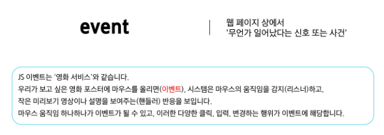

# 0519(JavaScript / Controlling Event).md

# Controlling Event

## 이벤트

> **일상속의 이벤트**
> 
- 컴퓨터 키보드를 눌러 텍스트를 입력하는 것
- 전화벨이 울려 전화가 왔음을 알리는 것
- 손을 흔들어 인사하는 것
- 전화기의 버튼을 눌러서 통화를 시작하는 것
- 리모컨을 사용하여 채널을 변경하는 것
- ,,,

> **웹에서의 이벤트**
> 
- 화면을 스크롤하는 것 (Key-up / Key-down)
- 버튼을 클릭했을 때 팝업 창이 출력되는 것
- 마우스 커서의 위치에 따라 드래그 앤 드롭하는 것
- 사용자의 키보드 입력 값에 따라 새로운 요소를 생성하는 것

→ 웹에서의 거의 모든 상호작용은 이벤트와 함께한다

### event

> **event**
> 



> **DOM 요소와 이벤트**
> 
- DOM 요소 : HTML 문서의 각 태그를 하나의 객체로 변환한 것
- 모든 DOM 요소는 다양한 형태의 이벤트를 발생시킬 수 있다
- 예) button 을 클릭하면 click 이벤트, input 값 변경 시 input 이벤트, …


## event object

> **event object**
> 
- DOM에서 이벤트가 발생하면, 브라우저는 해당 이벤트에 관한 정보를 담은 ‘event object’를 자동으로 생성한다
- 이벤트 종류
    - mouse
    - input
    - keyboard
    - …


> **DOM 요소에서 event가 발생하면**
> 

→ 해당 event는 연결된 이벤트 처리기(event handler)에 의해 처리 된다


### event handler

> event handler
> 

→ 특정 이벤트가 발생했을 때 실행되는 (콜백) 함수


> **.addEventListener( )**
> 

→ 특정 DOM 요소에, 지정한 이벤트가 발생했을 때 실행할 이벤트 핸들러를 등록하는 메서드


> **.addEventListener( ) 예시**
> 
- handleClick 함수가 이벤트 핸들러이며,
button.addEventListener( )는 그 핸들러를 click 이벤트에 연결해주는 역할

```jsx
const button = document.querySelector('button')

// 이벤트 핸들러
const handleClick = function () {
	window.alery('버튼이 클릭 되었습니다!')
}

// addEventListener 메서드를 이용해 버튼에 이벤트 핸들러를 등록
button.addEventListener('click', handleClick)
```

> **이벤트 등록 (addEventListener)**
> 
- DOM 요소 : HTML 문서의 각 태그를 하나의 객체로 변환한 것
- 수신할 이벤트 : 무언가 일어났다는 신호 또는 사건
- 핸들러 : 특정 이벤트가 발생했을 때 실행되는 (콜백) 함수


> **addEventListener 구조**
> 

```jsx
element.addEventListener('click', function (event) {
	// 이벤트 처리 로직
})
```

- 메서드 구문
    - .addEventListener(type, handler)
- type
    - 수신할 이벤트 유형
    - 문자열로 작성 (ex. ‘click’, ‘mouseover’ 등)
- handler
    - 이벤트 발생 시 호출되는 콜백 함수
    - 자동으로 event 객체를 첫번 째 매개변수로 받는다
    - 반환 값이 없다

> **이벤트 객체 전달**
> 
- 이벤트 발생 시, 이벤트 객체는 자동으로 이벤트 핸들러 함수에 인자로 전달된다
- 핸들러 함수는 이 인자를 통하여 이벤트에 대한 상세 정보 (이벤트 발생 요소, 이벤트 타입, 추가 데이터 등)에 접근하고 적절한 동작을 수행한다

`<button id="btn">버튼</button>`

```jsx
// 1. 버튼 요소 선택
const btn = document.querySelector('#btn')

// 2. 이벤트 핸들러
const detectClick = function (event) {
	console.log(event) // PointerEvent
	console.log(event.type) // click
}

// 3. 버튼에 이벤트 핸들러를 등록
btn.addEventListener('click', detectClick)
```

> **이벤트 핸들러에서의 this**
> 
- 일반 함수를 핸들러로 사용 시 , this는 이벤트 리스너가 연결된 요소를 가리킨다
    
    (event 객체의 currentTarget 속성 값과 동일)
    

`<button id="btn">버튼</button>`

```jsx
// 1. 버튼 선택
const btn = document.quertSelector('#btn')

// 2. 이벤트 핸들러
const detectClick = function (event) {
	console.log(event.currentTarget)    // <button id="btn">버튼</button>
	console.log(this) 	// <button id="btn">버튼</button>
}

// 3. 버튼에 이벤트 핸들러를 등록
btn.addEventListener('click', detectClick)
```

## 버블링

> **버블링 개요**
> 


> **버블링 (Bubbling)**
> 
- 한 요소에 이벤트가 발생하면, 해당 요소의 핸들러가 동작한 후 이어서 부모 요소의 핸들러가 동작하는 현상이다
- 가장 최상단의 조상 요소 (document)를 만날 때까지 이 과정이 반복되면서 요소 각각에 할당된 핸들러가 동작한다


→ 최하위의 <p> 요소를 클릭하면 p → div → form 순서로 3개의 이벤트 핸들러가 모두 순차적으로 동작했던 것


> **이벤트가 정확히 어디서 발생했는지 접근할 수 있는 방법**
> 
1. event.currentTarget
    - ‘현재’ 요소
    - 항상 이벤트 핸들러가 연결된 요소만을 참조하는 속성
    - ‘this’와 같다
2. event.target
    - 이벤트가 발생한 가장 안쪽의 요소(target)를 참조하는 속성
    - 실제 이벤트가 시작된 요소
    - 버블링이 진행 되어도 변하지 않는다

> **‘target’ & ‘currentTarget’ 예시**
> 


## 캡처링과 버블링

> **캡처링 (capturing)**
> 
- 이벤트가 최상위 조상에서 타겟 요소까지 하위로 전파되는 단계 (버블링과 반대)
- table의 하위 요소 td를 클릭하면, 이벤트는 먼저 최상위 요소부터 아래로 전파됨 (캡처링)
- 실제 이벤트가 발생한 지점(event.target)에서 실행된 후 다시 위로 전파 (버블링)


### 버블링의 필요성

> **버블링이 필요한 이유**
> 
- 만약 다음과 같이 각자 다른 동작을 수행하는 버튼이 여러 개가 있다고 가정하면,
각 버튼마다 서로 다른 이벤트 핸들러를 등록해야 할까?

→ 각 버튼의 공통 조상인 div요소에 이벤트 핸들러 단 하나만 할당하기


- 요소들의 공통 조상에 이벤트 핸들러를 하나만 등록하면, 여러 자식 요소에서 발생하는 이벤트를 한 곳에서 효율적으로 다룰 수 있다
- 공통 조상(div)에 할당한 핸들러에서 event.target을 이용하면 실제 어떤 버튼에서 이벤트가 발생했는지 알 수 있기 때문이다


### event handler 활용

> **event handler 활용 실습**
> 


## lodash

> **lodash**
> 


## 이벤트 기본 동작 취소하기

> **이벤트 기본 동작 취소하기**
> 
- HTML의 각 요소가 기본적으로 가지고 있는 이벤트가 때로는 방해가 되는 경우가 있어서 이벤트의 기본 동작을 취소할 필요가 있다
- 예시
    - form 요소의 제출 이벤트를 취소하여 페이지 새로고침을 막을 수 있다
    - <a> 태그를 클릭했을 때 페이지 이동을 막고, 대신 다른 로직을 수행하게 할 수 있다

> **preventDefault( )**
> 


> **이벤트 동작 취소 실습**
> 


## 참고

### addEventListener와 화살표 함수 관계

> **addEventListener에서의 화살표 함수 주의사항**
> 
- 화살표 함수는 자신만의 this를 가지지 않는다
- 대신, 자신이 선언된 상위 스코프의 this를 그대로 물려받아 사용
- 따라서 이벤트 핸들러로 화살표 함수를 사용하면, this는 대부분 전역 객체 (window)를 가리키게 된다
- 해결책
    - 일반 함수로 사용하기
    - 화살표 함수일 경우 event.currentTarget을 사용하기

```jsx
element.addEventListener('click', function () {
	console.log(this)   // <button id="function">function</button>
}) 

element.addEventListener('click', () => {
	console.log(this)  // window
})
```

### 정리


