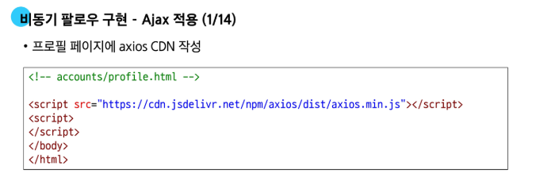

# 0521(JavaScript / 비동기 JS with Django).md

# AJAX with Django

## AJAX와 서버

### AJAX with follow (비동기 팔로우 구현 실습)

> **비동기 팔로우 구현 - AJAX 적용**
> 




> **‘data-*’ 속성**
> 
- 사용자 지정 데이터 속성을 만들어, HTML과 DOM 사이에서 임의의 데이터를 교환하는 방법
- 모든 사용자 지정 데이터는 JavaScript에서 dataset 속성을 통해 접근한다
- 주의사항
    - 대소문자 여부에 상관없이 ‘xml’ 문자로 시작 불가
    - 세미콜론 포함 불가
    - 대문자 포함 불가

```jsx
<div data-my-id='my-data'></div>

<script>
	const myId = event.target.dataset.myId
</script>
```


### AJAX with likes (비동기 좋아요 구현 실습)

> **AJAX 좋아요 적용 시 유의사항**
> 
- 전반적인 AJAX 적용 방식은 팔로우 구현 과정과 동일
- 하지만 팔로우와 달리, ‘좋아요’ 버튼은 한 페이지에 여러 개가 존재할 수 있다
- 그렇다면 모든 ‘좋아요’ 버튼에 각각 이벤트 리스너를 등록해야 하나?

> **비동기 좋아요 구현 - AJAX 적용**
> 


> **비동기 좋아요 구현 - 버블링을 활용하지 않았다면?**
> 
1. querySelectorAll( )을 사용해 전체 좋아요 버튼을 선택
    - querySelectorAll( ) 선택을 위한 class 적용


1. forEach( )를 사용하여 전체 좋아요 버튼을 순회하면서 진행


### 정리


