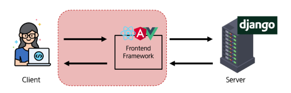

# 0526(Vue / Introduction of Vue.J.S).md

# Vue.J.S

## Frontend Development

> **Frontend Development**
> 
- 웹사이트와 웹 애플리케이션의 사용자 인터페이스(UI)와 사용자 경험(UX)을 만들고 디자인하는 것
- HTML, CSS, JavaScript 등을 활용하여 사용자가 직접 상호작용하는 부분을 개발한다



### Client-side frameworks

> **Client-side frameworks**
> 


> **Client-side frameworks가 필요한 이유**
> 
- 단순히 무언가를 읽는 곳에서 → 무언가를 하는 곳으로 변화
    - 사용자는 이제 웹에서 문서만을 읽는 것이 아닌 음악을 스트리밍하고, 영화를 보고, 지구 반대편 사람들과 텍스트 및 영상 채팅을 통해 즉시 통신하고 있다
- 이처럼 현대적이고 복잡한 대화형 웹 사이트를 “웹 애플리케이션(web applications)”이라 부른다
- JavaScript 기반의 Client-side frameworks가 등장하면서 매우 동적인 대화형 애플리케이션을 훨씬 더 쉽게 구축할 수 있게 된다
- 다루는 데이터가 많아졌다
    - 만약 친구가 이름을 변경했다면?
    - 친구 목록, 타임 라인, 스토리 등 친구 이름이 출력되는 모든 곳이 함께 변경되어야 한다
    - 애플리케이션의 기본 데이터를 안정적으로 추적하고 업데이트(렌더링, 추가, 삭제 등)하는 도구가 필요하다
    - 애플리케이션의 상태가 변경될 때마다 UI가 일관성 있게 업데이트되어야 한다

> **Vanila JS만으로는 간단하지 않다**
> 
- 불필요한 코드의 반복


> Client-side frameworks의 필요성
> 
1. **동적이고 반응적인 웹 애플리케이션 개발**
    - 실시간 데이터 업데이트
2. **코드 재사용성 증가**
    - 컴포넌트 기반 아키텍처
    - 모듈화 된 코드 구조
3. **개발 생산성 향상**
    - 강력한 개발 도구 지원

## SPA (Single Page Application)

> **SPA (Single Page Application)**
> 


> **Single Page Application (SPA) 작동 원리**
> 
1. 최초 로드 시, 어플리케이션에 필요한 주요 리소스를 다운로드
2. 페이지 갱신에 대해 필요한 데이터만을 비동기적으로 전달 받아 화면의 필요한 부분만 동적으로 갱신
    - AJAX와 같은 기술을 사용하여 필요한 데이터만 비동기적으로 로드
    - 페이지 전체를 다시 로드할 필요 없이, 필요한 데이터만 서버로부터 가져와서 화면에 표시
3. JavaScript를 사용하여 클라이언트 측에서 동적으로 콘텐츠를 생성하고 업데이트
    
    → CSR 방식
    

## CSR (Client Side Rendering)

> **CSR (Client Side Rendering)**
> 


> **Client Side Rendering (CSR) 작동 원리**
> 
1. 사용자가 웹사이트에 요청을 보낸다
2. 서버는 최소한의 HTML과 JavaScript 파일을 클라이언트로 전송
3. 클라이언트는 HTML과 JavaScript를 다운로드 받는다
4. 브라우저가 JavaScript를 실행하여 동적으로 페이지 콘텐츠를 생성
5. 필요한 데이터는 API를 통하여 서버로부터 비동기적으로 가져온다

> **CSR 작동 예시**
> 
1. 클라이언트는 서버로부터 최소한의 HTML 페이지와 어플리케이션 실행에 필요한 JavaScript를 응답 받는다
2. 그런 다음 클라이언트 측에서 JavaScript를 사용하여 DOM을 업데이트하고 페이지를 렌더링
3. 이후 서버는 더 이상 HTML을 제공하지 않고 요청에 필요한 데이터만 응답
4. Google Maps, Facebook, Instagram 등의 서비스에서 페이지 갱신 시 새로고침이 없는 이유


> **CSR 과 SPA 의 장점**
> 
1. **빠른 페이지 전환**
    - 페이지가 처음 로드된 후에는 필요한 데이터만 가져오면 되고 JavaScript는 전체 페이지를 새로 고칠 필요 없이 페이지의 일부를 다시 렌더링할 수 있기 때문이다
    - 서버로 전송되는 데이터의 양을 최소화 (서버 부하 방지)
2. **사용자 경험**
    - 새로고침이 발생하지 않아 네이티브 앱과 유사한 사용자 경험을 제공
3. **Frontend와 Backend의 명확한 분리**
    - Frontend는 UI 렌더링 및 사용자 상호 작용 처리를 담당 & Backend는 데이터 및 API 제공을 담당
    - 대규모 애플리케이션을 더 쉽게 개발하고 유지 관리 가능

> **CSR 과 SPA 의 단점**
> 
1. **느린 초기 로드 속도**
    - 전체 페이지를 보기 전에 약간의 지연을 느낄 수 있다
    - JavaScript가 다운로드, 구문 분석 및 실행될 때까지 페이지가 완전히 렌더링 되지 않기 때문이다
2. **SED (검색 엔진 최적화) 문제**
    - 페이지를 나중에 그려 나가는 것이기 때문에 검색에 잘 노출되지 않을 수 있다
    - 검색엔진 입장에서 HTML을 읽어서 분석해야 하는데 아직 콘텐츠가 모두 존재하지 않기 때문이다


> **SPA vs. MPA / CSR vs. SSR**
> 
- **Multi Page Application (MPA)**
    - 여러 개의 HTML 파일이 서버로부터 각각 로드
    - 사용자가 다른 페이지로 이동할 때마다 새로운 HTML 파일이 로드 된다
- Server-side Rendering (SSR)
    - 서버에서 화면을 렌더링 하는 방식
    - 모든 데이터가 담긴 HTML을 서버에서 완성 후 클라이언트에게 전달

## Vue

> **Vue**
> 


> **What is Vue?**
> 
- Evan You에 의해 발표 (2014)
    - Angular 개발팀 출신
- 최신 버전은 “Vue 3” (2024 ~)
    - Vue 2와 Vue 3는 각각 API가 다름
    
    → Vue 2 는 Options API
    
    → Vue 3 는 Compose API
    

> **Vue의 두 가지 핵심 기능**
> 
1. **선언적 렌더링 (Declarative Rendering)**
    - 표준 HTML을 확장하는 Vue “템플릿 구문” 을 사용하여 JavaScript 상태 (데이터)를 기반으로 화면에 출력될 HTML을 선언적으로 작성
2. **반응성 (Reactivity)**
    - JavaScript 상태 변경을 추적하고, 변경사항이 발생하면 자동으로 DOM을 업데이트

> **Vue의 주요 특징 정리**
> 
1. **반응형 데이터 바인딩**
    - 데이터 변경 시 자동 UI 업데이트
2. **컴포넌트 기반 아키텍처**
    - 재사용 가능한 UI 조각
3. **간결한 문법과 직관적인 API**
    - 낮은 학습 곡선
    - 높은 가독성
4. **유연한 스케일링**
    - 작은 프로젝트부터 대규모 애플리케이션까지 적합

### Component

> **Component**
> 
- **“재사용 가능한 코드 블록”**
- UI를 독립적이고 재사용 가능한 일부분으로 분할하고 각 부분을 개별적으로 다룰 수 있다
- 자연스럽게 애플리케이션은 중첩된 Component의 트리 형태로 구성된다


> **Component 예시**
> 
- 웹 서비스는 여러 개의 Component로 이루어져 있다


## Vue tutorial

> **Vue를 사용하는 두 가지 방법**
> 
1. ‘CDN’ 방식
2. ‘NPM’ 설치 방식

### Vue Application 생성

> **Vue Application 생성하기**
> 


### 반응형 상태

> **반응형 상태 ref( )**
> 


→  const 변수(주소를 저장) = ref( 0 ) ( { value : 1, 2, 3 ,,, } )

→ reference 타입의 객체로 저장이 된다. 변수에는 해당 객체의 주소 값이 저장된다

→ 따라서, 주소의 값이 바뀌지 않는 이상 reference 타입의 내부적인 변화는 어떻게 진행되든 상관이 없다

> **ref 함수**
> 
- 래핑 (wrapping) : 여러 요소를 하나의 태그나 컴포넌트로 감싸는 구조
- .value 속성이 있는 ref 객체로 래핑(wrapping)하여 반환하는 함수
- ref로 선언된 변수의 값이 변경되면, 해당 값을 사용하는 템플릿에서 자동으로 업데이트
- 인자는 어떠한 타입도 가능하다

```jsx
const { createApp, ref } = Vue

const app = createApp({
	setup() {
		const message = ref('Hello vue!')
		console.log(message) // ref 객체
		console.log(message.value) // Hello vue!
	}
})
```

- 템플릿의 참조에 접근하려면 setup 함수에서 선언 및 반환이 필요하다
- 편의상 템플릿에서 ref를 사용할 때는 .value를 작성할 필요가 없다 (자동으로 언래핑(unwrapped) 된다)

```jsx
const app = createApp({
	setup() {
		const message = ref('Hello vue!')
		return {
			message
		}
	}
})
```

```jsx
<!-- vue_instance.html -->

<div id="app">
	<h1>{{ message }}</h1>
</div>
```

- 즉, ref 함수는 반응형을 가지는 참조 변수를 만드는 것 (ref === reactive reference)

### Vue 기본 구조

> **Vue 기본 구조**
> 
- createApp( )에 전달되는 객체는 Vue 컴포넌트이다
- 컴포넌트의 상태는 setup( ) 함수 내에서 선언되어야 하며 반드시 객체를 반환해야 한다

```jsx
const app = createApp({
	setup() {
		const message = ref('Hello vue!')
		
		return {
			message
		}
	}
})
```

> **템플릿 렌더링**
> 
- 반환된 객체의 속성은 템플릿에서 사용할 수 있다
- Mustache syntax(콧수염 구문, {{ }} )를 사용하여 메시지 값을 기반으로 동적 텍스트를 렌더링
    - 동적 텍스트 : 데이터 (변수) 값에 따라 내용이 실시간으로 바뀌는 텍스트

```jsx
const app = createApp({
	setup() {
		const message = ref('Hello vue!')
		
		return {
			message
		}
	}
})
```

```jsx
<div id="app">
	<h1>{{ message }}</h1>
</div>
```

- 콘텐츠는 식별자나 경로에만 국한되지 않으며 유효한 JavaScript 표현식을 사용할 수 있다

```jsx
<h1>{{ message.split('').reverse().join('') }}</h1>
```

> **Event Listners in Vue**
> 
- `'v-on'` directive를 사용하여 DOM 이벤트를 수신할 수 있다
- 함수 내에서 반응형 변수를 변경하여 구성 요소 상태를 업데이트


## 참고

### ref 객체

> **ref 객체가 필요한 이유**
> 
- 일반적인 변수가 아닌 객체 데이터 타입으로 사용하는 이유는?
    - Vue는 템플릿에서 ref를 사용하고 나중에 ref의 값을 변경하면 자동으로 변경 사항을 감지하고,
    그에 따라 DOM을 업데이트 한다 (”의존성 추적 기반의 반응형 시스템”)
- Vue는 렌더링 중에 사용된 모든 ref를 추적하며, 이후 ref의 값이 변경되면 해당 ref를 사용하는 컴포넌트를 다시 렌더링
- 이를 위해서 참조 자료형의 객체 타입으로 구현한 것
    - JavaScript에서는 일반 변수의 접근 또는 변형을 감지할 방법이 없기 때문이다
    - [https://vuejs.org/guide/essentials/reactivity-funodamentals.html#why-refs](https://vuejs.org/guide/essentials/reactivity-funodamentals.html#why-refs)

> **반응형 변수 vs. 일반 변수**
> 
- ref는 값이 바뀌면 화면이 자동으로 업데이트 되지만, 일반 변수는 값이 바뀌어도 화면이 갱신되지 않는다


### Ref Unwrap 주의사항

> **템플릿에서의 unwrap 시 주의사항**
> 
- 템플릿에서의 unwrap은 ref가 setup에서 반환된 객체의 최상위 속성일 경우에만 적용
    
    ```jsx
    const object = { id: ref(0) }
    
    {{ object.id + 1 }} // [object object]
    ```
    
- [object object] 가 출력되는 이유
    - object는 최상위 속성이지만 object.id는 그렇지 않다
    - 표현식을 평가할 때, object.id가 unwrap 되지 않고 ref 객체로 남아 있기 때문이다

→ 해결 방법?

- 이 문제를 해결하기 위해서는, id를 객체에서 분해하여 최상위 속성으로 만들어야 한다

```jsx
const object = { id: ref(0) }
const { id } = object

{{ id + 1 }} // 1
```

- 단, ref가 “{{ }}”의 최종 평가 값인 경우는 unwrap이 가능하다

```jsx
const object = { id: ref(0) }

{{ object.id }} // 0
{{ object.id.value }} // 0
```

### SEO (Search Engine Optimization)

> **SEO (Search Engine Optimization)**
> 
- google, bing과 같은 검색 엔진 등에 내 서비스나 제품 등이 효율적으로 검색 엔진에 노출되도록 개선하는 과정을 일컫는 작업이다
    - 검색 엔진 : 웹 상에 존재하는 가능한 모든 정보들을 긁어 모으는 방식으로 동작한다
- 정보의 대상은 주로 HTML에 작성된 내용
- 최근에는 SPA, 즉 CSR롤 구성된 서비스의 비중이 증가
- SPA 서비스도 검색 대상으로 넓히기 위해 JS를 지원하는 방식으로 발전하는 중이다

### 정리


