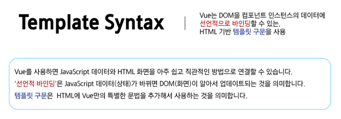

# 0527(Vue / Basic Syntax 01).md

# Basic Syntax 01

## Template Syntax

> **Template Syntax**
> 



> **Template Syntax 종류**
> 
- Text Interpolation
- Raw HTML
- Attribute Bindings
- JavaScript Expressions

> **Text Interpolation**
> 
- 데이터 바인딩의 가장 기본적인 형태
    - 데이터 바인딩 : 자바스크립트 데이터와 HTML 화면을 동기화하여 연결하는 것
- 이중 중괄호 구문 (콧수염 구문) 을 사용
- 콧수염 구문은 해당 컴포넌트 인스턴스의 msg 속성 값으로 대체
- msg 속성이 변경될 때마다 업데이트 된다

```jsx
<p>Message: {{ msg }}</p>
```

> **Raw HTML**
> 
- 콧수염 구문은 데이터를 일반 텍스트로 해석하기 때문에 실제 HTML을 출력하려면 v-html을 사용해야 한다


> **Attribute Bingdings**
> 
- 콧수염 구문은 HTML 속성 내에서 사용할 수 없기 때문에 v-bind를 사용
- HTML의 id 속성 값을 vue의 dynamicId 속성과 동기화 되도록 한다
- 바인딩 값이 null이나 undefind인 경우, 해당 속성은 렌더링 요소에서 제거된다


> **JavaScript Expressions**
> 
- JavaScript 표현식 : 하나의 값으로 평가 (계산) 될 수 있는 모든 코드 조각
- Vue는 모든 데이터 바인딩 내에서 JavaScript 표현식의 모든 기능을 지원한다
- Vue 템플릿에서 JavaScript 표현식을 사용할 수 있는 위치
    1. 콧수염 구문 내부
    2. 모든 디렉티브의 속성 값 (”v-”로 시작하는 특수 속성)


> **Expressions 주의사항**
> 
- 각 바인딩에는 하나의 단일 표현식만 포함될 수 있다
    - 표현식은 값으로 평가할 수 있는 코드 조각 (return 뒤에 사용할 수 있는 코드여야 한다)
- 작동하지 않는 경우
    
    ```jsx
    <!-- 표현식이 아닌 선언식 -->
    {{ const number = 1 }}
    
    <!-- 제어문은 삼항 표현식을 사용해야 한다 -->
    {{ if (ok) {return message} }}
    ```
    

### Directive

> **Directive**
> 


> **Directive 특징**
> 
- Directive의 속성 값은 단일 JavaScript 표현식이어야 한다 (v-for, v-on은 제외)
- 표현식 값 (ex: “seen”) 이 변경될 때 DOM에 반응적으로 업데이트를 적용
- 예시
    
    ```jsx
    <p v-if=-"seen">Hi There</p>
    ```
    


> **Directive 전체 구문**
> 
- Name (이름) : Directive의 핵심 이름으로, 어떤 종류의 기능을 수행할지를 의미한다
- Argument (전달 인자) : Directive가 ‘무엇에 대해’ 동작할지 알려주는 구체적인 대상
- Modifiers (수식어) : 점으로 표시되는 특별한 접미사로, Directive의 기본 동작을 수정할 수 있다
- Value (값) : Directive에 연결될 JavaScript 표현식


> **Directive: “Arguments”**
> 
- 일부 directive는 directive 뒤에 콜론(” : ”)으로 표시되는 인자를 사용할 수 있다
- 아래 예시의 href는 HTML <a> 요소의 href 속성 값을 myUrl 값에 바인딩 하도록 하는 v-bind의 인자
    
    ```jsx
    <a v-bind:href="myUrl">Link</a>
    ```
    
- 아래 예시의 click은 이벤트 수신할 이벤트 이름을 작성하는 v-on의 인자
    
    ```jsx
    <button v-on:click="doSomething">Button</button>
    ```
    

> **Directive: “Modifiers”**
> 
- “. (dot)”로 표시되는 특수 접미사로, directive가 특별한 방식으로 바인딩 되어야 함을 나타낸다
- 예시의 .prevent는 발생한 이벤트에서 event.preventDefault( )를 호출하도록 v-on에 지시하는 modifier
    
    ```jsx
    <form v-on:submit.prevent="onSubmit">
    	<input type="submit">
    </form>
    ```
    


> **Built-in Directives**
> 
- v-text
- v-show
- v-if
- v-for
- …
    
    → [https://vuejs.org/api/built-in-directives.html](https://vuejs.org/api/built-in-directives.html)
    

## Dynamically data binding

## v-bind

> **v-bind**
> 


> **Directive**
> 
1. Attribute Bindings
2. Class and Syle Bindings

### Attribute Bindings

> **Attribute Bindings (속성 바인딩)**
> 
- HTML의 속성 값을 Vue의 상태 속성 값과 동기화
    
    ```jsx
    <!-- v-bind.html -->
    
    
    <a v-bind:href="myUrl">Move to url</a>
    ```
    
- v-bind shorthand (약어)
    - ‘ : ‘ (colon)
    
    ```jsx
    
    <a :href="myUrl">Move to url</a>
    ```
    

> **Dynamic attribute name (동적 인자 이름)**
> 
- 대괄호 ([ ])로 감싸서 directive argument에 JavaScript 표현식을 사용할 수 있다
- 표현식에 따라 동적으로 평가된 값이 최종 argument 값으로 사용된다


> **Attribute Bindings 예시**
> 


### Class and Style Bindings

> **Class and Style Bindings (클래스와 스타일 바인딩)**
> 
- class와 style은 모두 HTML 속성이므로 다른 속성과 마찬가지로 v-bind를 사용하여 동적으로 문자열 값을 할당할 수 있다
- Vue는 class 및 style 속성 값을 v-bind로 사용할 때 객체 또는 배열을 활용하여 작성할 수 있도록한다
    
    → 단순히 문자열 연결을 사용하여 이러한 값을 생성하는 것은 번거롭고 오류가 발생하기가 쉽기 때문
    

> **Class and style Bindings가 가능한 이유**
> 
- **Binding HTML Classes**
    - 1.1 Binging to Objects
    - 1.2 Binding to Arrays
- **Binding Inline Styles**
    - 2.1 Binding to Objects
    - 2.2 Binding to Arrays

> **1.1 Binding HTML Classes: Binding to Objects**
> 
- 객체를 :class에 전달하여 클래스를 동적으로 전환할 수 있다
- 예시 1
    - isActive의 Boolean 값에 의해 active 클래스의 존재가 결정된다
    
    ```jsx
    <!-- binding-html-classes.html -->
    
    const isActive = ref(true)
    
    <div :class="{ active: isActive }">Text</div>
    ```
    
    - 변환 후 실제로 웹에서 출력되는 태그 모습
    
    
    
- 객체에 더 많은 필드를 포함하여 여러 클래스를 전환할 수 있다
- 예시 2
    - :class directive를 일반 클래스 속성과 함께 사용 가능
    
    ```jsx
    const isActive = ref(false)
    const hasInfo = ref(true)
    
    <div class="static" :class= "{ active: isActive, 'text-primary': hasInfo }>Text</div>
    ```
    
    - 변환 후 실제로 웹에서 출력되는 태그 모습
    
    
    
- Inline 방식이 아닌 반응형 변수를 활용하여 객체를 한번에 작성하는 방법
- 예시 3
    
    ```jsx
    const isActive = ref(false)
    const hasInfo = ref(true)
    
    // ref는 반응 객체의 속성으로 액세스되거나 변경될 때 자동으로 unwrap
    const classObj = ref ({
    	active: isActive,
    	'text-primary': hasInfo
    })
    
    <div class="static" :class="classObj">Text</div>
    ```
    
    - 변환 후 실제로 웹에서 출력되는 태그 모습
    
    
    

> **1.2 Binding HTML Classes: Binding to Arrays**
> 
- :class를 배열에 바인딩하여 클래스 목록을 적용할 수있다
- 예시 1
    
    ```jsx
    const activeClass = ref('active')
    const infoClass = ref('text-primary')
    
    <div :class="[activeClass, infoClass]">Text</div>
    ```
    
    - 변환 후 실제로 웹에서 출력되는 태그 모습
    
    
    
- 배열 구문 내에서 객체 구문을 사용하는 경우
- 예시 2
    
    ```jsx
    const isActive = ref(false)
    const infoClass = ref('text-primary')
    
    <div :class="[{ active: isActive }, infoClass]>Text</div>
    ```
    
    - 변환 후 실제로 웹에서 출력되는 태그 모습
    
    
    

> **2.1 Binding Inlin Styles: Binding to Objects**
> 
- :style은 HTML의 style 속성에 JavaScript 객체를 바인딩하는 것을 지원한다
- 예시 1
    
    ```jsx
    <!-- binding-inline-styles.html -->
    
    const activeColor = ref('crimson')
    const fontSize = ref(50)
    
    <div :style="{ color: acriveColor, fontSize: fontSize + 'px' }">Text</div>
    ```
    
    - 변환 후 실제로 웹에서 출력되는 태그 모습
    
    
    
- 실제 CSS에서 사용하는 것처럼 :style 은 kebab-cased 키 문자열도 지원한다 (단, camelCase 작성을 권장)
- 예시 2
    
    ```jsx
    <div :style="{ color: activeColor, 'font-size': fontSize + 'px' }">Text</div>
    ```
    
    - 변환 후 실제로 웹에서 출력되는 태그 모습
    
    
    
- inline 방식이 아닌 반응형 변수를 활용하여 객체를 한번에 작성하는 방법
- 예시 3
    
    ```jsx
    const activeColor = ref('crimson')
    const fontSize = ref(50)
    const styleObj = ref ({
    	color: activeColor,
    	fontSize: fontSize.value + 'px'
    })
    
    <div :style="styleObj">Text</div>
    ```
    
    - 변환 후 실제로 웹에서 출력되는 태그 모습
    
    
    

> **2.2 Binding Inline Styles: Binding to Arrays**
> 
- 여러 스타일 객체를 배열에 작성해서 :style을 바인딩할 수 있다
- 작성한 객체는 병합되어 동일한 요소에 적용
- 예시
    
    ```jsx
    const styleObj2 = ref({
    	color: 'blue',
    	border: '1px solid black',
    })
    
    <div :style="[styleObj, styleObj2]">Text</div>
    ```
    
    - 변환 후 실제로 웹에서 출력되는 태그 모습
    
    
    

> **v-bind 종합**
> 
- 해당 링크 참고
    - [https://vuejs.org/api/built-in-directives.html#v-bind](https://vuejs.org/api/built-in-directives.html#v-bind)

## Event Handling

### v-on

> **v-on**
> 


> **v-on 구성**
> 
- DOM 요소에 이벤트 리스너를 연결 및 수신
    
    ```jsx
    v-on:event="handler"
    ```
    
- v-on shorthand (약어)
    - ‘@’
    
    ```jsx
    @event="handler"
    ```
    
- handler 종류
    1. Inline handlers : 이벤트가 트리거 될 때 실행 될 JavaScript 코드
    2. Method handlers : 컴포넌트에 정의된 메서드 이름


> **Inline handlers**
> 
- Inline handlers는 주로 간단한 로직에 사용한다
- 복잡한 표현식이 들어가면 템플릿에서 코드를 이해하기 어려워진다
- 재사용이 불가능하여 유지보수가 어렵다

```jsx
<!-- event-handling.html -->

const count = ref(0)

<button @click="count++">Add 1</button>
<p>Count: {{ count }}</p>
```

> **Method Handlers**
> 
- 메서드 핸들러는 setup에 정의된 메서드를 호출하는 방식이다
- 로직이 복잡할 경우, Method를 분리하면 템플릿이 간결해지고 코드를 재사용하기 좋다
- Inline handlers로는 불가능한 대부분의 상황에서 사용한다


- @click=”myFunc” 처럼 괄호 없이 메서드 이름만 연결하면 핸들러의 첫 번째 인자로 DOM의 event 객체가 자동으로 전달 된다
    - event 객체  : 이벤트 발생 시, 이벤트 상세 정보를 담아 전달되는 객체


> **사용자 지정 인자 전달**
> 
- 기본 이벤트 대신 사용자 지정 인자를 전달할 수도 있다


> **Inline Handlers에서의 event 인자 접근**
> 
- Inline Handlers에서 원래 DOM 이벤트에 접근하기
- $event 변수를 사용하여 메서드에 전달


- $event 변수를 전달하는 위치는 상관 없다


## Modifiers

> **Event Modifiers**
> 
- Modifiers : 디렉티브 뒤에 점( . )으로 붙여, 특별한 동작을 추가하는 기능이다
- Vue는 Event Modifiers를 제공하여, event.preventDefault( )와 같은 코드를 메서드 안에 직접 작성할 필요가 없도록 해야 한다
- 대신 stop, prevent, self 등 다양한 modifiers를 제공한다
- 이는 메서드 로직을 순수하게 데이터 관련 처리에만 집중시키기 위함이다


> **Event Modifers 예시**
> 


> **Key Modifiers**
> 
- 키보드 이벤트를 수신할 때 특정 키에 관한 별도 modifiers를 사용할 수 있다
- 예시 1
    - Enter 키가 입력 되었을 때만 onSubmit 이벤트를 호출하기
    
    ```jsx
    <input @keyup.enter="onSubmit">
    ```
    
- 예시 2
    - Ctrl + Enter로 댓글 등록하기
    
    ```jsx
    <textarea @keydown.ctrl.enter="submitComment"></textarea>
    ```
    

> **v-on 종합**
> 
- 해당 링크 참고
    - [https://vuejs.org/api/built-in-directives.html#v-on](https://vuejs.org/api/built-in-directives.html#v-on)

## Form Input Bindings

> **Form Input Bindings (폼 입력 바인딩)**
> 
- form을 처리할 때 사용자가 input에 입력하는 값을 실시간으로 JavaScript 상태에 동기화해야 하는 경우
(양방향 바인딩)
- 양방향 바인딩 방법 두 가지
    1. v-bind와 v-on을 함께 사용
    2. v-model 사용

### v-bind with v-on

> **v-bind와 v-on을 함께 사용**
> 
1. v-bind로 input요소의 value 속성을 반응형 변수에 연결
2. v-on으로 input 이벤트가 발생할 때마다, input의 현재 값을 반응형 변수에 저장한다


### v-model

> **v-model**
> 


- 사용자 입력 데이터와 반응형 변수를 실시간으로 동기화


#### v-model 활용

> **v-model과 다양한 입력(input) 양식**
> 
- v-model은 단순 Text input 뿐만 아니라 다양한 타입의 사용자 입력 방식과 함께 사용 가능하다
    - Checkbox
    - Select
    - Radio
    - textarea
    - …

> **Checkbox 활용**
> 


> **Select 활용**
> 


> **v-model 종합**
> 
- **해당 링크 참고**
    - [https//vuejs.org/api/built-in-directives.html#v-model](http://vuejs.org/api/built-in-directives.html#v-model)

## 참고

### 접두어 $

> **‘ $ ‘ 접두어가 붙은 변수**
> 
- Vue 인스턴스 내에서 사용할 수 있도록 Vue가 제공하는 공용 프로퍼티
- 사용자가 지정한 반응형 변수나 메서드와 구분하기 위함이다
    
    → 주로 Vue 인스턴스 내부 상태를 다룰 때 사용한다
    


### IME (Input Method Editor)

> **IME (Input Method Editor)**
> 
- 사용자가 입력 장치에서 기본적으로 사용할 수 없는 문자(비영어권 문자)를 입력할 수 있도록 하는 운영 체제 구성 프로그램
- 일반적으로 키보드 키보다 자모가 더 많은 언어에서 사용해야 한다
- IME가 활성화된 상태 (예 : 한글 조합 중) 에서 input 이벤트가 발생하는 방식과 v-model의 업데이트 방식이 충돌하여, 의도치 않은 동작이 발생할 수 있다


### 정리


