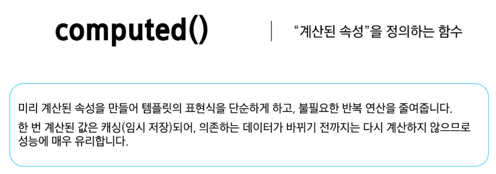

# 0528(Vue / Basic Syntax 02).md

# Basic Syntax 02

## Computed Properties

### Computed

> **computed( )**
> 



> **Computed가 없는 경우**
> 
- 할 일이 남았는지 여부에 따라 다른 메시지를 출력하기


→ 템플릿이 복잡해지며 todos에 따라 계산을 수행하게 된다

→ 만약 이 계산을 템플릿에 여러 번 사용하는 경우에는 매번 계산이 발생한다

> **Computed를 사용하는 경우**
> 
- 반응형 데이터를 포함하는 복잡한 로직의 경우 computed를 활용하여 미리 값을 계산하여 계산된 값을 사용한다
- 여러 곳에서 사용해야 한다면, computed로 정의된 restOfTodos를 필요한 곳마다 재사용하면 된다


> **computed 특징**
> 
- 반환되는 값은 계산된 ref (computed ref) 이며, 일반 ref와 유사하게 계산된 결과를 .value로 참조가 가능하다 (템플릿에서는 .value 생략이 가능)
    - computed ref : 원본 데이터가 바뀔 때만, 값을 알아서 다시 계산하는 ref
- computed 속성은 의존된 반응형 데이터를 자동으로 추적한다
- 의존하는 반응형 데이터가 변경될 때만 재평가
    
    ```jsx
    const resfOfTodos = computed(() => {
    	return todos.value.length > 0 ? '아직 남았다' : '퇴근!'
    })
    ```
    
    - restOfTodos의 계산은 todos에 의존하고 있다
    - 따라서 todos가 변경될 때만 restOfTodos가 업데이트 된다

### Computed vs. Methods

> **computed와 동일한 로직을 처리할 수 있는 method**
> 
- computed 속성 대신 method로도 동일한 기능을 정의할 수 있다


> **computed와 method 차이**
> 
- computed 속성은 의존하는 반응형 데이터를 기반으로 그 결과를 캐시(cached)한다
    - 캐시(cached) : 데이터를 임시로 저장하여 다음에 같은 데이터를 요청할 때 더 빠르게 접근할 수
                              있도록 하는 기술이나 저장 공간
- 의존하는 데이터가 변경된 경우에만 재평가된다
- 의존하는 데이터가 변경되지 않는 한, 해당 computed 속성에 여러 번 접근해도 함수를 다시 실행하지 않고 캐시된 결과를 즉시 반환한다

→ 반면, method 호출은 다시 렌더링이 발생할 때마다 항상 함수를 실행한다


> **캐시 (Cache)**
> 


> **computed와 method의 적절한 사용처**
> 
- **computed**
    - 의존하는 데이터에 따라 결과가 바뀌는 계산된 속성을 만들 때 유용하다
    - 동일한 의존성을 가진 여러 곳에서 사용할 때 계산 결과를 캐싱하여 중복 계산을 방지한다
- **method**
    - 단순히 특정 동작을 수행하는 함수를 정의할 때 사용한다
    - 데이터에 의존하는지 여부에 관계없이 항상 동일한 결과를 반환하는 함수

> **method와 computed 정리**
> 
- **computed**
    - 의존된 데이터가 변경되면 자동으로 업데이트
- **method**
    - 호출해야만 실행이 된다

→ 무조건 computed만 사용하는 것이 아니라 사용 목적과 상황에 맞게 computed와 method를 적절히 조합하여 사용한다

## Conditional Rendering

### v-if

> **v-if**
> 


- ‘v-if’ Directive를 사용하여 조건부로 블록을 렌더링
    - Directive : ‘v-’ 접두사가 있는 특수 속성


> **v-else**
> 
- ‘v-if’ Directive를 사용하여 조건부로 렌더링


> **v-else-if**
> 
- ‘v-else-if’ directive를 사용하여 v-if에 대한 else if 블록을 나타낼 수 있다
- name에 할당된 값을 바꾸면 조건에 맞는 태그가 보인다


> **여러 요소에 대한 v-if 적용**
> 
- <template> 요소에 v-if를 사용하면, 여러 요소를 하나의 조건부 블록으로 묶을 수 있다
    
    (v-else, v-else-if 모두 적용 가능하다)
    


### v-if vs v-show

> **v-show**
> 


> **v-show 예시**
> 
- v-show를 사용한 요소는 조건과 관계 없이 항상 DOM에 렌더링 된다
- CSS display 속성만 전환하기 때문 (none 속성으로 변환)
    - CSS display : 요소를 블록, 인라인, 플렉스 등 어떤 방식으로 배치할지 정의


> **v-if 와 v-show 의 적절한 사용처**
> 
- **v-if (Cheap initial load, expensive toggle)**
    - 초기 조건이 false 인 경우 아무 작업도 수행하지 않는다
    - 토글 비용이 높다
- **v-show (Expensive initial load, Cheap toggle)**
    - 초기 조건에 관계 없이 항상 렌더링
    - 초기 렌더링 비용이 더 높다
- 렌더링 : 코드를 보고 실제 화면을 만드는 과정이다

**※ 콘텐츠를 매우 자주 전환해야 하는 경우에는 v-show를, 실행 중에 조건이 변경되지 않는 경우에는 v-if를 권장**

## List Rendering

### v-for

> **v-for**
> 


> **v-for 구조**
> 
- v-for는 alias in expression 형식의 특별한 구문을 사용한다

```jsx
<div v-for="item in items">
	{{ item.text }}
</div>
```

- 객체는 key-value 쌍으로 이루어져 있어, 값(value), 키(key), 인덱스(index)를 조합하여 순회할 수 있다

```jsx
<!- 가장 기본적인 구조 -->
<div v-for="(item, index) in arr"></div>

<!- 값만 순회 -->
<div v-for="value in object"></div>

<!- 값과 키를 순회 -->
<div v-for="(value, key) in object"></div>

<!- 값과 키, 인덱스를 순회 -->
<div v-for="(value, key, index) in object"></div>
```

> **v-for 예시**
> 


> **여러 요소에 대한 v-for 적용**
> 
- HTML template 요소에 v-for를 사용하여 하나 이상의 요소에 대해 반복 렌더링 할 수 있다


> **중첩된 v-for**
> 
- 각 v-for 의 하위 영역(scope)은 상위 영역에 접근 할 수 있다


#### v-for with key

> **v-for와 key**
> 
- v-for 구문은 각 요소를 key를 활용하여 고유한 값으로 식별할 수 있다
- key는 각 항목을 고유하게 식별할 수 있는 문자열이나 숫자여야 한다


> **내장 특수 속성 ‘key’의 특징**
> 
- 각 항목이 서로 구분되는 고유 식별자 역할
- number 혹은 string으로만 사용해야 한다
- Vue의 내부 가상 DOM 알고리즘이 이전 목록과 새 노드 목록을 비교할 때 각 node를 식별하는 용도로 사용한다
- key를 통해 “ 이 항목은 이 데이터에 해당한다 “ 는 힌트를 줌으로써 변경 시에도 올바른 항목만 효율적으로 업데이트할 수 있다

**→ “ 반드시 v-for와 key를 함께 사용한다”**


> **올바른 key 선택 기준**
> 
- 권장되는 key 값
    - 데이터베이스의 고유 ID
    - 항목 고유 식별자 (예 : UUID)
        - UUID : 중복되지 않는 아주 긴 고유 식별 번호
- 피해야 할 key 값
    - 배열 인덱스 (index)
    - 객체 자체

#### v-for with v-if

> **v-for 와 v-if 문제 상황**
> 


> **v-for 와 v-if 해결법 두 가지**
> 
1. computed 활용
2. v-for 와 <template> 요소 활용

> **v-for와 v-if 해결법 01 : computed 활용**
> 
- computed를 활용하여 이미 필터링 된 목록을 반환하여 반복하도록 설정


> **v-for와 v-if 해결법 02: v-for와 <template>요소 활용**
> 
- v-for와 template 요소를 사용하여 v-if 위치를 이동


## Watchers

### watch

> **watch**
> 


> **watch 구조**
> 
1. **첫번째 인자 (source)**
    - watch가 감시하는 대상
    (반응형 변수, 값을 반환하는 함수 등)
2. **두번째 인자 (callback function)**
    - source가 변경될 때 호출되는 콜백 함수
    1. newValue
        - 감시하는 대상이 변화된 값
    2. oldValue (optional)
        - 감시하는 대상의 기존 (변화 전) 값

```jsx
watch(source, (newValue, oldValue) => {
	// do something
})
```

> **watch 기본 동작**
> 
- count 반응형 데이터가 변경될 때마다, 그 변화를 감지하여 특정 작업을 수행
- 버튼을 누를 때마다 count 값이 바뀌고, watch는 그 변화를 “감시” 하고 있다가 즉시 콜백함수를 실행


> **watch 예시**
> 
- 감시하는 변수에 변화가 생겼을 때 연관 데이터 업데이트


> **여러 source를 감시할 수 도 있는 watch**
> 
- 배열을 활용하여 여러 대상을 감시할 수 있다

```jsx
watch([foo, bar], ([newFoo, newBar], [prevFoo, prevBar]) => {
	// do something
})
```


## computed vs watch

> **computed와 watch**
> 


## Lifecycle Hooks

> **Lifecycle Hooks**
> 
- Vue 컴포넌트가 생성되고, DOM에 마운트되고, 업데이트되고, 소멸되는 각 생애 주기 단계에서 실행되도록 제공되는 함수

> **Lifecycle Hooks Diagram**
> 
- 컴포넌트의 생애 주기 중간 중간에 함수를 제공한다

※ 개발자는 컴포넌트의 특정 시점에 원하는 로직을 실행할 수 있다


> **주요 Lifecycle Hooks**
> 
- 생성 단계 / 마운트 단계 / 업데이트 단계 / 소멸 단계 등 다양한 단계 존재
- 가장 일반적으로 사용되는 것은 onMounted, onUpdated, onUnmounted
- [https://vuejs.org/pai/composition-api-lifecycle.html](https://vuejs.org/pai/composition-api-lifecycle.html)


> **주요 Lifecycle Hooks : Mounting**
> 
- Vue  컴포넌트 인스턴스가 초기 렌더링 및 DOM 요소 생성이 완료된 후 특정 로직을 수행하기


> **주요 Lifecycle Hooks : Updated**
> 
- 반응형 데이터의 변경으로 인해 컴포넌트의 DOM이 업데이트된 후 특정 로직을 수행하기


### Lifecycle Hooks 활용

> **Lifecycle Hooks with Cat API**
> 
- Mount 시점에 Cat api에 요청을 보내고 애플리케이션 시작하기
- 


## Vue Style Guide

> **Vue Style Guide**
> 


> **우선순위 별 특징**
> 


## 참고

### computed 주의사항

> **computed의 반환 값은 변경하지 말 것**
> 
- computed의 반환 값은 의존하는 데이터의 파생된 값
    - 이미 의존하는 데이터에 의해 계산이 완료된 값이다
- 일종의 snapshot이며 의존하는 데이터가 변경될 때만 새 snapshot이 생성된다
- 계산된 값은 읽기 전용으로 취급되어야 하며 변경되어서는 안된다
- 대신 새 값을 얻기 위해서는 의존하는 데이터를 업데이트 해야 한다


> **computed 사용 시 원본 배열을 변경하지 말 것**
> 
- computed에서 reverse( )나 sort( )처럼 원본 배열을 변경하는 메서드를 사용할 때는,
반드시 원본 배열의 복사본을 만들어 처리해야 한다
- 옳지 않은 예시

```jsx
return numbers.reverse()
```

- 옳은 예시

```jsx
return [...numbers].reverse()
```


### Lifecycle Hooks 주의사항

> **Lifecycle Hooks 주의사항**
> 
- Lifecycle Hooks는 반드시 동기적으로 작성해야 한다
- Vue는 컴포넌트가 초기화될 때 모든 Hooks를 한 번에 스캔하고 준비하기 때문이다
- 만약 비동기로 (예 : setTimeout) 훅을 등록하려고 하면, 이미 라이프사이클 단계가 지나간 후에  hooks를 설정하는 상황이 발생한다

```jsx
// 비동기적으로 작성한 lifecycle hook 예시

setTimeout(() => {
	onMounted(() => {
		console.log('이 코드는 실행되지 않습니다!')
	})
}, 100)
```

- 비동기로 작성할 경우 Vue는 해당 훅을 인식하지 못하며, 원래 의도한 타이밍에 실행되지 않게 된다
- Lifecycle Hooks는 컴포넌트 로딩 과정에서 동기적으로 정의함으로써,
Vue가 올바른 타이밍에 해당 로직을 수행할 수 있도록 보장해야 한다

### v-for와 배열을 활용한 “필터링 / 정렬”

> **v-for와 배열을 활용한 “ 필터링 / 정렬 “ 활용**
> 


### 배열 변경 관련 메서드

> **배열 변경 관련 메서드**
> 
- v-for와 배열을 함께 사용 시 배열의 메서드를 주의해서 사용해야 한다
1. 변화 메서드
    - 호출하는 원본 배열을 변경
    - push( ), pop( ), shift( ), unshift( ), splice( ), sort( ), reverse( )
2. 배열 교체
    - 원본 배열을 수정하지 않고 항상 새 배열을 반환
    - filter( ), concat( ), slice( )

### Todo 애플리케이션 구현

> **Todo 애플리케이션 구현 예시**
> 


### 정리


