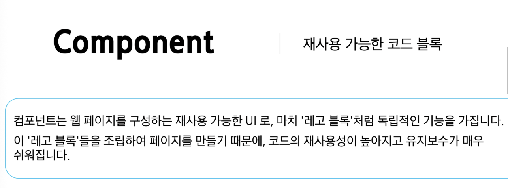

# 0601(Vue / SFC,Single File Component).md

# Single File Components

## Component

> **Component**
> 



> **Component 특징**
> 
- UI를 독립적이고 재사용 가능한 일부분으로 분할하고 각 부분을 개별적으로 다룰 수 있다
- 자연스럽게 애플리케이션은 중첩된 Component의 트리 형태로 구성된다


> **Component 예시**
> 
- 웹 서비스는 여러 개의 Component로 이루어져 있다


> **Single-File Components**
> 


> **SFC 파일 예시**
> 
- Vue SFC는 HTML, CSS 및 JavaScript를 단일 파일로 합친 것이다
- <template>, <script> 및 <style> 블록은 하나의 파일에서 컴포넌트의 뷰, 로직 및 스타일을 독립적으로 배치한다


### SFC 구성요소

> **SFC 구성요소**
> 
- 각 *.vue 파일은 세 가지 유형의 최상위 언어 블록
<template>, <script>, <style>으로 구성된다
    
    → 언어 블록의 작성 순서는 상관 없으나 일반적으로는
    template → script → style 순서로 작성한다
    


> **<template> 블록**
> 
- 각 *.vue 파일은 최상위 <template> 블록을 하나만 포함할 수 있다


> **<script setup> 블록**
> 
- 각 *.vue 파일은 <script setup> 블록을 하나만 포함할 수 있다
(일반 <script> 제외)
- 컴포넌트의 setup( ) 함수로 사용되며 컴포넌트의 각 인스턴스에 대하여 실행한다

→ 변수 및 함수는 동일한 컴포넌트의 템플릿에서 자동으로 사용이 가능하다


> **<style scoped> 블록**
> 
- *.vue 파일에는 여러 <style> 태그가 포함될 수 있다
- scoped가 지정되면 CSS는 현재 컴포넌트에만 적용된다


> **컴포넌트 사용하기**
> 
- [https://play.vuejs.org/](https://play.vuejs.org/) 에서 Vue 컴포넌트 코드 작성 및 미리보기
- Vue SFC는 일반적인 방법으로 실행할 수 없으며 컴파일러를 통해 컴파일 된 후 빌드 되어야 한다
    
    → 실제 프로젝트에서는 Vite와 같은 공식 빌드(build) 도구를 사용한다
    
    - 빌드 (build) : 개발자가 쓴 소스 코드를, 실행 가능한 파일로 변환하는 과정


### SFC build tool

#### Vite

> **Vite**
> 


> **Build**
> 
- 프로젝트의 소스 코드를 최적화하고 번들링하여 배포할 수 있는 형식으로 변환하는 과정
    - 번들링 : 여러 개의 흩어진 코드 파일을, 하나로 합쳐주는 작업
- 개발 중에 사용되는 여러 소스 파일 및 리소스 (JavaScript, CSS, 이미지 등)를 최적화된 형태로 조합하여 최종 소프트웨어 제품을 생성하는 것

→ Vite는 이러한 빌드 프로세스를 수행하는 데 사용되는 도구이다

## NPM

> **Node Package Manager**
> 


> **Node JS**
> 
- Chrome의 V8 JavaScript 엔진을 기반으로 하는 Server-Side 실행 환경
    - Server-Side : 브라우저가 아닌 서버에서, 로직을 처리하는 것
- 브라우저 안에서만 동작할 수 있었던 JavaScript를 브라우저가 아닌 서버 측에서도 실행할 수 있게 하였다
    
    → 프론트엔드와 백엔드에서 동일한 언어로 개발할 수 있게 된다
    
- NPM을 활용하여 수 많은 오픈 소스 패키지와 라이브러리를 제공하여 개발자들이 손쉽게 코드를 공유하고 재사용할 수 있게 한다


## Vue Project

> **Vue Project 생성**
> 


## 모듈과 번들러

> **Module**
> 


> **Module의 한계**
> 
- 애플리케이션이 점점 더 발전함에 따라 처리해야 하는 JavaScript 모듈의 개수도 극적으로 증가
- 이러한 상황에서 성능 병목 현상이 발생하고 모듈 간의 의존성(연결성)이 깊어지면서 특정한 곳에서 발생한 문제가 어떤 모듈 간의 문제인지 파악하기 어려워졌다
- 복잡하고 깊은 모듈 간 의존성 문제를 해결하기 위한 도구가 필요!
    
    **→ Bundler**
    

> **node_modules의 의존성 깊이**
> 
- node_modules : npm install로 설치한 모든 패키지들이 모여있는 저장소


> **Bundler**
> 


> **Bundler의 역할**
> 
- 의존성 관리, 코드 최적화, 리소스 관리 등
- Bundler가 하는 작업을 Bundling이라고 한다

→ Vite는 Rollup이라는 Bunlder를 사용하며 개발자가 별도로 기타 환경설정에 신경 쓰지 않도록 모두 설정해두고 있다


### Vue Project 구조

> **Vue Project 기본 구조**
> 
1. public 디렉토리
2. src 디렉토리
3. index.html
4. 기타 설정 파일
5. 패키지 관리 파일
    - package.json
    - package-lock.json
    - node_modules


> **public 디렉토리**
> 
- 주로 다음 정적 파일을 위치 시킨다
    - 소스코드에서 참조되지 않는 코드
    - 항상 같은 이름을 갖는 코드
    - import할 필요 없는 코드
- 항상 root 절대 경로를 사용하여 참조한다
    - 만약 public/icon.png가 있다면 다른 소스 코드에서 /icon.png 경로로 참조할 수 있다


> **src 디렉토리**
> 
- 프로젝트의 주요 소스 코드를 포함하는 곳이다
- 실제로 우리가 작업하게 될 대부분의 소스 코드가 위치한다
- 컴포넌트, 스타일, 라우팅 등 프로젝트의 핵심 코드를 관리한다


> **src/assets**
> 
- 프로젝트 내에서 사용되는 정적 자원 (이미지, 폰트, 스타일 시트 등)을 관리
- 컴포넌트 자체에서 참조하는 내부 파일을 저장하는데 사용한다
- 컴포넌트가 아닌 곳에서는 public 디렉토리에 위치한 파일을 사용한다


> **src/components**
> 
- 프로젝트의 주요 소스 코드를 포함하는 곳
- 실제로 우리가 작업하게 될 대부분의 소스 코드가 위치한다
- 컴포넌트, 스타일, 라우팅 등 프로젝트의 핵심 코드를 관리한다


> **src/App.vue**
> 
- Vue 앱의 Root 컴포넌트이다
- 다른 하위 컴포넌트들을 포함한다
- 애플리케이션 전체의 레이아웃과 공통적인 요소를 정의한다


> **src/main.js**
> 
- Vue 애플리케이션을 초기화하고, App.vue를 DOM에 마운트하는 시작점이다
- 필요한 라이브러리를 import하고 전역 설정을 수행한다


> **index.html**
> 
- Vue 앱의 기본 HTML 파일
- main.js에서 App.vue 컴포넌트를 렌더링하고, index.html 특정 위치를 마운트 시킨다 → Vue 앱이 SPA인 이유
    - SPA (Single Page Application) : 하나의 페이지 안에서, 내용만 바꿔가며 보여주는 웹 앱
- 필요한 스타일 시트, 스크립트 등의 외부 리소스를 로드 할 수 있다 (ex, bootstrap CDN, ,,,)


> **기타 설정 파일**
> 
- jsconfig.json : 컴파일 옵션, 모듈 시스템 등 설정
    - 컴파일 옵션 : 디버깅, 최적화 등 컴파일의 세부 방식을 제어하는 명령어
- vite.config.js :
    - Vite 프로젝트 설정 파일
    - 플러그인, 빌드 옵션, 개발 서버 설정 등
        - 플러그인 : 기존 프로그램에 새로운 기능을 추가하는 확장 프로그램


### 패키지 관리

> **package.json**
> 
- 프로젝트에 관한 기본 정보와 패키지 의존성을 정의하는 “설계도” 파일
(메타데이터 파일)
- 프로젝트가 어떤 패키지를 사용하고, 어떤 스크립트를 실행할 수 있는지 명시한다
- npm install 시 이를 참조하여 패키지를 설치한다
    - 어떤 패키지를 설치해야 하는지 결정하는 기준 제공
    - Django의 requirements.txt와 비슷한 개념


> **package.json 특징**
> 
- 프로젝트 메타 데이터
    - 프로젝트 이름, 버전, 스크립트 명령, 패키지 의존성 등의 정보가 명시된다
- 의존성(Dependencies) 목록
    - 어떤 패키지를 사용하는지, 어떤 버전 범위를 허용하는지를 기록한다

→ “집을 짓기 전에 필요한 재료 목록과 건축 계획서”

> **package-lock.json**
> 
- package.json을 기반으로 실제 설치된 패키지들의 “정확한 버전 정보” 를 기록하는 파일이다
- 실제로 어느 버전의 패키지가 설치되었는지 확정하고 기록한다
- 다른 환경에서도 동일한 패키지 구성을 재현 가능하게 한다


> **package-lock.json 특징**
> 
- 정확한 버전 고정
    - 프로젝트를 설치할 때 실제로 어떤 버전의 패키지가 설치 되었는지를 기록한다
- 빌드 안정성 보장
    - 협업 또는 배포 환경에서, 모든 개발자가 동일한 패키지 버전을 사용하도록 보장한다
- 자동 관리
    - npm install 결과가 반영되어 매번 자동 업데이트 된다

> **node-modules**
> 
- package.json과 package-lock.json에 따라 실제로 설치된 모든 패키지가 저장되는 곳이다
- 프로젝트 실행 시 필요한 모든 라이브러리와 코드 파일을 보관한다
- 애플리케이션 구동 시 참조되는 실제 데이터 저장소이다


> **node-modules 특징**
> 
- npm install을 통해 설치된 모든 패키지(모듈)들이 실제로 저장
    - 개발 시 직접 수정할 필요는 없으며, npm install시 자동 관리된다
    - 직접 수정하지 않고, 필요 시 npm install로 언제든 재생성 가능하다
- 용량이 매우 클 수 있으며, 협업 시 일반적으로 Git으로 추적하지 않는다
(.gitignore에 포함시켜야 된다)

> **패키지 관리 정리**
> 
- package.json
    - 어떤 패키지가 필요하고 어떤 버전 범위를 허용할지 정의하는 “설계도”
- package-lock.json
    - 실제로 설치한 패키지의 정확한 버전을 기록하는 “상세 내역서”
- node_modules
    - 이 설계도와 내역서에 따라 내려 받은 실제 패키지 “자재 창고”

## Vue Component 활용

> **컴포넌트 사용 3단계**
> 
1. 사전 준비
2. 컴포넌트 파일 생성
3. 컴포넌트 등록 (import)

> **사전 준비**
> 
- 초기에 생성된 모든 컴포넌트 삭제 (App.vue 제외)
- App.vue 코드 초기화

```jsx
<!-- App.vue -->

<template>
	<h1>App.vue</h1>
</template>

<script setup>
</script>
```

> **컴포넌트 파일 생성**
> 
- components 폴더 하위에 MyComponent.vue 생성

```jsx
<!-- components/MyComponent.vue -->

<template>
	<div>
		<h2>MyComponent</h2>
	</div>
</template>

<script setup>
</script>
```

> **컴포넌트 등록**
> 
- App 컴포넌트에 MyComponent를 등록
- App(부모) - MyComponent(자식) 관계 형성
- “@” - “src/” 경로를 뜻하는 약어

```jsx
<!-- App.vue -->

<template>
	<h1>App.vue</h1>
	<MyComponent />
</template>

<script setup>
// import MyComponent from './components/MyComponent.vue'
import MyComponent from '@/components/MyComponent.vue'
</script>
```

> **결과 확인**
> 
- Vue dev tools를 사용하여 컴포넌트 관계 형성 확인


> **추가 하위 컴포넌트 등록 후 활용**
> 
- MyComponentItem.vue 생성
- MyComponentItem은 MyComponent의 자식 컴포넌트

+ 컴포넌트의 재사용성 확인하기


> **Component 이름 지정 스타일 가이드**
> 


## 추가 주제

### Virtual DOM

> **Vue에서는 직접적으로 DOM에 접근하는 것을 권장하지 않고 있다**
> 
- JavaScript에서 사용하는 DOM 접근 관련 메서드 사용 금지
    - querySelector, createElement, addEventListener 등
- Vue의 ref( ) 와 Lifecycle Hooks 함수를 사용하여 간접적으로 접근해 조작할 것
    
    → 이유는 성능과 코드의 예측 가능성을 극대화 하기 위하여
    
    → 이를 가능하게 하는 것이 ‘가상돔(Virtual DOM)’
    

> **Virtual DOM**
> 


- 실제 DOM과의 변경 사항 비교를 통해 변경된 부분만 실제 DOM에 적용하는 방식이다
- 웹 애플리케이션의 성능을 향상시키기 위한 Vue의 내부 렌더링 기술

```jsx
<!-- index.html -->

<!DOCTYPE html>
<html lang="en">
	<head>
		...
	</head>
	<body>
		<div id="app"></div> // Vue의 영역 (Virtual DOM)
		<script type="module" src="/src/main.jx"></script>
	</body>
</html>
```

> Virtual DOM 내부 렌더링 과정
> 
1. 작성한 HTML 템플릿을 Virtual DOM을 그려내는 설계도 (렌더 함수 코드)로 변환
2. 렌더 함수 코드를 바탕으로 Virtual DOM을 생성
3. Virtual DOM을 실제 DOM에 마운트
4. 컴포넌트의 데이터(반응형 상태)가 바뀔 때마다 새로운 가상돔을 만들어 이전과 비교하고, 바뀐 부분만 효율적으로 찾아 실제 DOM을 업데이트


> **Virtual DOM 패턴의 장점**
> 
1. 효율성
    - 실제 DOM 조작을 최소화하고, 변경된 부분만 업데이트하여 성능을 향상
2. 반응성
    - 데이터의 변경을 감지하고, Virtual DOM을 효율적으로 갱신하여 UI를 자동으로 업데이트
3. 추상화
    - 개발자는 실제 DOM 조작을 Vue에게 맡기고 컴포넌트와 템플릿을 활용하는 추상화된 프로그래밍 방식으로 원하는 UI 구조를 구성하고 관리할 수 있다

> **Virtual DOM 주의 사항**
> 
- 실제 DOM에 직접 접근하지 말 것
    - JavaScript에서 사용하는 DOM 접근 관련 메서드(querySelector, createElement, … ) 사용 금지
    - 아래와 같은 예측 불가능한 문제가 발생할 수 있다
        1. 데이터와 화면의 불일치 (상태 불일치)
        2. 예측 불가능한 렌더링
        3. 코드의 복잡성 증가

→ Vue의 ref( )와 Lifecycle Hooks 함수를 사용해 간접적으로 접근하여 조작할 것

> **직접 DOM 엘리먼트에 접근해야 하는 경우**
> 
- ref 속성을 사용하여 특정 DOM 엘리먼트에 직접적인 참조를 얻을 수 있다


### Composition API & Option API

> **Vue를 작성하는 두 가지 스타일**
> 
- **Composition API (Vue 3)**
    - import해서 가져온 API함수들을 사용하여 컴포넌트의 로직을 정의
    
    → Vue 3에서의 권장 방식
    


- **Option API (Vue 2)**
    - data, methods 및 mounted 같은 객체를 사용하여 컴포넌트의 로직을 정의
    - Vue2 에서의 작성 방식 (Vue 3에서도 지원)


> **API 별 권장 사항**
> 
- Composition API + SFC
    - 규모가 있는 앱의 전체를 구축하려는 경우
- Option API
    - 빌드 도구를 사용하지 않거나 복잡성이 낮은 프로젝트에서 사용하려는 경우

## 참고

### Single Root Element

> **모든 컴포넌트에는 최상단 HTML 요소가 작성되는 것이 권장**
> 
- 가독성, 스타일링, 명확한 컴포넌트 구조를 위해 각 컴포넌트에는 최상단 HTML 요소를 작성해야 한다 (Single Root Element)


### CSS scoped

> **CSS scoped 속성**
> 
- <style scoped>를 사용하면 해당 컴포넌트 내부의 스타일이 현재 컴포넌트 내부 요소에게만 적용되도록 범위를 제한하는 기능
- 스타일이 컴포넌트 바깥으로 유출되거나, 다른 컴포넌트에서 정의한 스타일이 현재 컴포넌트를 침범하지 않도록 막아준다

```jsx
<style scoped> </style>
```

- CSS Scoped를 사용하지 않는다면?
    - <style>에 scoped를 붙이지 않으면, 해당 스타일은 전역(모든 컴포넌트)에 영향을 미친다
    - 예를 들어, 다른 컴포넌트에서도 div 태그를 사용했다면 그 스타일이 함께 적용된다

> **부모 - 자식 관계에서의 스타일 전파**
> 
- 일반적으로 scoped 스타일은 부모 컴포넌트의 스타일이 자식 컴포넌트에 영향을 미치지 않는다
- 하지만 예외적으로 자식 컴포넌트의 “최상위 요소(root element)”에는 부모 컴포넌트의 scoped 스타일도 영향을 줄 수 있다
- 이는 부모가 자식 컴포넌트를 레이아웃 할 때 필요한 경우가 있기 때문이다
(예 : 자식 컴포넌트의 외곽 박스 크기나 마진 조정)

→ 즉, 자식 컴포넌트의 가장 바깥쪽을 감싸는 요소에 한해서는 부모의 scoped 스타일 적용이 의도적으로 허용되어 있다

- 다음과 같이 App(부모) 컴포넌트에 적용한 스타일에 scoped가 작성 되어 있지만, MyComponent(자식)의 최상위 요소(div)는 부모와 본인의 CSS 모두의 영향을 받기 때문에 부모 컴포넌트에 지정한 스타일이 적용된다


> **CSS scoped를 적용한 이유**
> 
- Vue는 부모 컴포넌트가 자식 컴포넌트의 최상위 요소 스타일을 제어할 수 있어야 레이아웃(배치) 목적을 쉽게 달성할 수 있다고 판단했기 때문이다
- 이로 인하여 자식 컴포넌트의 root element는 부모와 자식 모두의 scoped 스타일이 영향을 미칠 수 있다

→ 최상위 App 컴포넌트에서 레이아웃 스타일을 전역적으로 구성할 수 있지만, 다른 모든 컴포넌트는 범위가 지정된 스타일을 사용하는 것을 권장한다

### Scaffolding

> **Scaffolding**
> 


> **관심사항의 분리가 파일 유형의 분리와 동일한 것이 아니다**
> 
- “HTML / CSS / JS를 한 파일에 혼합하는게 괜찮을까?”

→ 프론트엔드 앱의 사용 목적이 점점 더 복잡해짐에 따라, 단순 파일 유형으로만 분리하게 될 경우 프로젝트의 목표를 달성 하는데 도움이 되지 않게 된다


### 패키지 관리 주의사항

> **패키지 관리 주의사항**
> 
1. npm install을 입력하는 위치
    - 항상 프로젝트 루트 디렉토리(프로젝트를 생성한 폴더)에서 실행
2. node_modules 폴더 관리 주의
    - 필요할 때마다 npm install을 통해 재성성 할 수 있으므로, 직접 수정하거나 Git으로 관리할 필요가 없다
3. package.json과 package-lock.json 직접 편집 자제
    - npm install 패키지명 명령을 통해 자동 업데이트 하는 것이 안전
4. 문제가 발생했을 때 재설치 고려
    - 패키지 버전 충돌이나 이상 동작이 의심될 때는 node_modules 폴더를 삭제한 뒤 다시 npm install을 실행

### 정리


