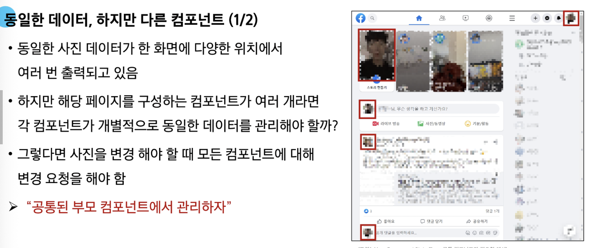

# 0602(Vue / Component State Flow).md

# Component State Flow

## Passing Props

## Props

> **동일한 데이터, 하지만 다른 컴포넌트**
> 




> **Props**
> 


> **Props 특징**
> 
- 부모의 데이터가 업데이트되면 자식에게 전달되지만, 그 반대는 불가능하다
- 또한 부모 컴포넌트가 업데이트될 때마다 이를 사용하는 자식 컴포넌트의 모든 props가 최신 값으로 업데이트 된다

→ 부모 컴포넌트에서만 변경하고 이를 내려 받는 자식 컴포넌트는 자연스럽게 갱신

→ 자식 컴포넌트 내부에서 props를 변경하려고 시도해서는 안되며 불가능하다


> **One-Way-Data Flow**
> 
- 모든 props는 자식 속성과 부모 속성 사이에 하향석 단방향 바인딩을 형성
(One-Way-down binding)
- 단방향인 이유
    - 하위 컴포넌트가 실수로 상위 컴포넌트의 상태를 변경하여 앱에서의 데이터 흐름을 이해하기 어렵게 만드는 것을 방지하기 위함이다
    (무한 루프, 디버깅 난이도 상승 등)
    - 데이터 흐름의 “일관성” 및 “예측 가능성”을 높이는 것이 목표이다

### Props 선언

> **사전 준비**
> 


> **Props 작성**
> 
- 부모 컴포넌트 Parent에서 자식 컴포넌트 ParentChild에 보낼 props 작성


> **Props 선언**
> 
- 부모 컴포넌트에서 내려 보낸 props를 사용하기 위해서는 자식 컴포넌트에서 명시적인 props 선언 필요
- defineProps( )를 사용하여 props를 선언

```jsx
<script setup>
	defineProps()
</script>
```

- defineProps( )에 전달하는 인자의 형태에 따라 선언 방식이 나뉜다
    1. “문자열 배열” 을 사용한 선언
    2. “객체” 를 사용한 선언

> **문자열 배열을 사용한 선언**
> 
- 배열의 문자열 요소로 props 선언
- 문자열 요소의 이름은 전달된 props의 이름

```jsx
<!-- ParentChild.vue -->

<script setup>
	defineProps(['myMsg'])
</script>
```

> **객체를 사용한 선언**
> 
- 각 객체 속성의 키가 전달받은 props 이름이 된다
- 객체 속성의 값은 해당 데이터의 타입에 맞는 생성자 함수(String, Number 등) 여야 한다

```jsx
<!-- ParentChild.vue -->

<script setup>
	defineProps({
		myMsg: String
	})
</script>
```


> **props 데이터 사용**
> 
- props 선언 후 템플릿에서 반응형 변수와 같은 방식이나 JS에서 props를 객체로 접근 가능


> **한 단계 더 props 내려 보내기**
> 


### Props 세부사항

> **Props 세부사항**
> 
1. Props Name Casing (Props 이름 컨벤션)
2. Static Props 와 Dynamic Props

> **Props Name Casing**
> 
- 부모 템플릿에서 전달 시 (HTML 속성) → kebab-case (my-msg)

```jsx
<ParentChild my-msg="message" />
```

- 자식 스크립트에서 선언 시 (JavaScript) → camelCase (myMsg)

```jsx
<template>
	<div>
		<p>{{ myMsg }}</p>
	</div>
</template>

<script setup>
	defineProps({
		myMsg: String,
	})
</script>
```

> **Static props & Dynamic props**
> 
- 지금까지 작성한 것은 Static(정적) props
- v-bind를 사용하여 동적으로 할당된 props를 사용할 수 있다
    - v-bind :  하나 이상의 속성 또는 컴포넌트 데이터를 표현식에 동적 바인딩


### Props 활용

> **v-for와 함께 사용하여 반복되는 요소를 props로 전달하기**
> 


## Component Events

## Emit

> **동일한 데이터, 하지만 다른 컴포넌트**
> 
- 부모는 자식에게 데이터를 전달 (Pass Props)
- 자식은 자신에게 일어난 일을 부모에게 알린다 (Emit event)


> **Emit**
> 


> **emit 메서드**
> 


- 자식 컴포넌트가 이벤트를 발생시켜 부모 컴포넌트에게 신호를 보내고 데이터를 전달하는 기능이다
- event
    - 커스텀 이벤트 이름
- args
    - 추가 인자


### 이벤트 발신 및 수신

> **이벤트 발신 및 수신 (Emitting and Listening to Events)**
> 


> **이벤트 발신 및 수신하기**
> 


### emit 이벤트 선언

> **emit 이벤트 선언**
> 
- defineEmits( )를 사용하여 발신할 이벤트를 선언
- props와 마찬가지로 defineEmits( )에 작성하는 인자의 데이터 타입에 따라 선언 방식이 나뉜다
    - 배열
    - 객체 (가급적 객체를 활용한 선언을 추천)
- defineEmits( )는 <script setup> 내에서 이벤트를 발신하기 위한 emit 함수를 반환한다
(템플릿의 $emit과 달리 <script setup>에서는 직접 접근할 수 없기 때문)

> **emit 이벤트 선언 활용**
> 
- 이벤트 선언 방식으로 추가 버튼 작성 및 결과 확인


### 이벤트 전달

> **이벤트 인자 (Event Arguments)**
> 
1. ParentChild에서 이벤트를 발신하여 Parent로 추가 인자 전달하기

```jsx
// 자식 컴포넌트
const emit = defineEmits(['emitArgs'])

const emitArgs = function () {
	emit('emitArgs', 1, 2, 3)
}
```

1. ParentChild에서 발신한 이벤트를 Parent에서 수신

```jsx
// 부모 컴포넌트

const getNumbers = function (...args) {
	console.log(args)
	console.log(`ParentChild가 전달한 추가인자 ${args}를 수신했어요.`)
}
```

> **이벤트 인자 전달 활용**
> 


### 이벤트 세부사항

> **Event Name Casing**
> 
- 선언 및 발신 시 (→ camelCase)

```jsx
<button @click="$emit('someEvent')">클릭</button>

<script setup>
	const emit = defineEmits(['someEvent'])
	
	emit('someEvent')
</script>
```

- 부모 컴포넌트에서 수신 시 ( → kebab-case )

```jsx
<ParentChild @some-event="..." />
```

### emit 이벤트 활용

> **emit 이벤트 실습**
> 


## 참고

### 정적 & 동적 props 주의사항

> **정적 & 동적 props 주의사항**
> 
- 첫 번째는 정적 props로 문자열 “1”을 전달
- 두 번째는 동적 props로 숫자 1을 전달

```jsx
<!-- 1 -->
<SomeComponent num-props="1" />

<!-- 2 -->
<SomeComponent :num-props="1" />
```

### Props & Emit 객체 선언 문법

> **Props 선언 시 “객체 선언 문법”을 권장하는 이유**
> 
- 컴포넌트의 의도를 명확히 하여 가독성을 높이고, 다른 개발자가 잘못된 타입의 데이터를 전달했을 때 콘솔에 경로를 출력하여 실수를 방지한다
- 추가로 props에 대한 유효성 검사로써 활용 가능


> **emit 이벤트도 “객체 선언 문법” 으로 작성 가능**
> 
- emit 이벤트 또한 객체 구문으로 선언 된 경우 유효성을 검사할 수 있다

