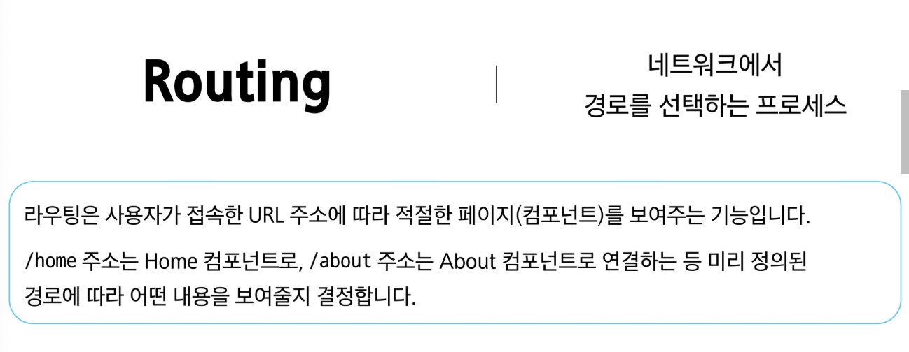

# 0603(Vue / Router).md

# Router

## Routing

> **Routing**
> 



> **SSR에서의 Routing**
> 
- SSR : 서버에서 완성된 HTML 페이지를 만들어, 브라우저에 보내는 방식
- SSR에서 routing은 서버 측에서 수행한다
- 서버가 사용자가 방문한 URL 경로를 기반으로 응답을 전송한다
- 링크를 클릭하면 브라우저는 서버로부터 HTML 응답을 수신하고 새 HTML로 전체 페이지를 다시 로드한다


> **CSR에서의 Routing**
> 
- CSR : 서버는 뼈대만 주고, 브라우저가 직접 페이지를 그리는 방식이다
- CSR에서의 routing은 클라이언트 측(브라우저)에서 수행한다
- 클라이언트 측 JavaScript가 새 데이터를 동적으로 가져와 전체 페이지를 다시 로드 하지 않는다


> **SPA에서 Routing이 없다면**
> 
- 유저가 URL을 통한 페이지의 변화를 감지할 수 없다
- 페이지가 무엇을 렌더링 중인지에 대한 상태를 알 수 없다
    - URL이 1개이기 때문에 새로 고침 시 처음 페이지로 되돌아간다
    - 링크를 공유할 시 첫 페이지만 공유가 가능하다
- 브라우저의 뒤로 가기 기능을 사용할 수 없다

→ 페이지는 1개이지만, 주소에 따라 여러 컴포넌트를 새로 렌더링하여 마치 여러 페이지를 사용하는 것 처럼 보이도록 해야 한다

## Vue Router

> **Vue Router**
> 


> **사전 준비**
> 
- Vite로 프로젝트 생성 시  Router 추가


- 서버 실행 후 Router로 인한 프로젝트 변화 확인

→ Home, About 링크에 따라 변경되는 URL과 새로 렌더링 되는 화면 확인


> **Vue 프로젝트 구조 변화**
> 
1. App.vue 코드 변화
2. router 폴더 신규 생성
3. views 폴더 신규 생성


> **App.vue 코드 변화 : RouterLink**
> 
- 페이지를 다시 로드 하지 않고 URL을 변경하여 URL 생성 및 관련 로직을 처리한다
- HTML의 <a> 태그를 렌더링


> **App.vue 코드 변화 : RouterView**
> 
- RouterLink URL에 해당하는 컴포넌트를 표시
- 원하는 곳에 배치하여 컴포넌트를 레이아웃에 표시 할 수 있다


> **RouterLink와 RouterView**
> 


> **router/index.js**
> 
- 라우팅에 관련된 정보 및 설정이 작성 되는 곳
- 웹 사이트 여러 페이지들의 주소 목록을 작성한다 (’ / ‘, ‘home’, ,,, )
- 각 주소로 접속했을 때, 어떤 Vue 컴포넌트 (페이지 화면)를 보여줄 지 연결


> **views**
> 
- RouterView 위치에 렌더링 할 컴포넌트를 배치
- 기존 components 폴더와 기능적으로 다른 것은 없으며 단순 분류의 의미로 구성된다

→ 일반 컴포넌트와 구분하기 위해 컴포넌트 이름을 View로 끝나도록 작성하는 것을 권장한다


## Basic Routing

> **라우팅 기본 동작 순서**
> 
1. index.js 에 라우터 관련 설정 작성
2. RouterLink에 index에 정의한 주소 값 작성
3. RouterLink 클릭 시 경로와 일치하는 컴포넌트가 RouterView에서 렌더링

> **라우팅 기본 동작 살펴보기**
> 


## Named Routes

> **path 경로를 그대로 사용하기**
> 
- 현재는 index.js에서 입력한 path 경로를 그대로 RouterLink에 사용하고 있다
- 이 방식은 URL 경로를 변경할 때, 해당 경로를 사용한 모든 파일을 일일이 찾아다니며 사용해야 하는 단점이 있다 (유지보수 난이도 증가)


> **Named Routes**
> 
- name 속성 값에 경로에 대한 이름을 지정한다
- 경로에 연결하려면 RouterLink에 v-bind를 사용하여 ‘to’ props 객체로 전달이 가능하다
- 하드 코딩된 URL을 사용하지 않아도 되며, 오타를 방지 할 수 있다


## Dynamic Route Matching

> **일정한 패턴의 URL 작성을 반복해야 하는 경우**
> 
- 주어진 패턴의 여러 경로를 하나의 컴포넌트에 매핑해야 하는 경우는 어떻게 해야할까?
- 예시) 모든 사용자의 ID를 활용하여 프로필 페이지 URL을 설계
    - user/1
    - user/2
    - user/3
    
    → 일정한 패턴의 URL 작성을 반복해야 한다
    

→ 이럴 때 사용하는 것이 바로 Dynamic Route Matching

> **Dynamic Route Matching**
> 


> **매개변수를 사용한 동적 경로 매칭 활용**
> 


## Nested Routes

> **애플리케이션의 UI는 여러 레벨 깊이로 중첩된 컴포넌트로 구성되기도 한다**
> 
- 이 경우, URL 도한 중첩된 컴포넌트 구조에 맞춰 표현할 수 있다
- 이를 Nested Routes 라 부른다


> **Nested Routes**
> 


> **중첩된 라우팅 활용**
> 


> **중첩된 라우팅 주의사항**
> 
- 컴포넌트 간 부모-자식 관계 관점이 아닌 “URL에서의 중첩된 관계를 표현” 하는 관점으로 바라보기
- 자식 라우트의 path는 /없이 작성해야, 부모 경로 뒤에 자동으로 연결된다
- 부모 라우트의 파라미터(:id)는 자식 컴포넌트에서도 바로 접근해서 사용할 수 있다

## Programmatic Navigation

> **Programmatic Navigation**
> 


- 프로그래밍으로 URL 이동하기
- router의 인스턴스 메서드를 사용해 RouterLink로 <a> 태그를 만드는 것처럼 프로그래밍으로 네비게이션 관련 작업을 수행할 수 있다
- router의 메서드
    1. router.push( )
        - 다른 위치로 이동하기
    2. router.replace( )
        - 현재 위치 바꾸기

> **router.push( )**
> 
- 다른 URL로 이동하는 메서드
- 새 항목을 history stack에 push 하므로 사용자가 브라우저 뒤로 가기 버튼을 클릭하면 이전 URL로 이동할 수 있다
- RouterLink를 클릭했을 때 내부적으로 호출되는 메서드이므로 RouterLink를 클릭하는 것은 router.push( )를 호출하는 것과 같다


> **router.push( ) 활용**
> 
- UserView 컴포넌트에서 HomeView 컴포넌트로 이동하는 버튼 만들기


> **router.replace( )**
> 
- 현재 위치를 바꾸는 메서드
- push 메서드와 달리 history stack에 새로운 항목을 push 하지 않고 다른 URL로 이동 (=== 이동전 URL로 뒤로 가기 불가)


> **router.replace( ) 활용**
> 
- UserView 컴포넌트에서 HomeView 컴포넌트로 이동하는 버튼 만들기


> **[참고] router.push의 인자 활용**
> 
- [https://router.vuejs.org/guide/essentials/navigation.html](https://router.vuejs.org/guide/essentials/navigation.html)


## route 와 router

### route

> **useRoute( )**
> 
- 현재 활성화된 “경로 정보(route)”를 담은 route 객체를 반환
- useRoute( )는 컴포넌트의 setup 함수나 <script setup> 최상단에서만 호출해야 한다


> **route 객체**
> 
- 현재 URL 상태를 보여주는 역할
    - route 객체 자체를 통해 페이지 이동(네비게이션)을 직접 제어할 수는 없다
- 읽기 전용이며, 현재 URL/파라미터쿼리/name/matched 된 라우트 정보 등을 담고 있다
    - 경로 파라미터(route.params), 쿼리(route.query), name(route.name) 등을 통해 현재 페이지 상태를 알 수 있다
- 반응형이며, URL이 변경되면 route 객체도 자동으로 변경된다
    - 예시) [route.params.id](http://route.params.id) 를 참조하고 있다면, URL이 바뀌어 id가 변경될 때 해당 값이 자동으로 반영된다

### router

> **useRouter( )**
> 
- 라우터 인스턴스 router 객체를 반환
- useRouter는 페이지 이동 등 액션용, useRoute는 경로 정보 읽기용으로 역할이 다르다


> **router 객체**
> 
- 애플리케이션 전체 라우팅 로직을 제어할 수 있는 핵심 객체
- 페이지 이동, 네비게이션 관련 메서드 제공
    - router.push(’~’), router.replace(’~’) 등을 통해 프로그래밍적으로 라우트를 변경할 수 있다
- 네비게이션 가드 등록, 히스토리 제어 같은 기능 사용이 가능하다

> **route 와 router 정리**
> 
- useRoute( )
    - 현재 라우트 “상태”를 읽어오는 전용 객체
- useRouter( )
    - 라우팅 로직 “제어” 및 페이지 이동을 담당하는 인스턴스


## Navigation Guard

> **Navigation Guard**
> 


> **Navigation Guard 종류**
> 
1. Globally (전역 가드)
    - 애플리케이션 전역게서 모든 라우트 전환에 적용되는 가드
2. Per-route (라우터 가드)
    - 특정 라우트에만 적용되는 가드
3. In-component (컴포넌트 가드)
    - 컴포넌트 내에서만 적용되는 가드

### Globally Guard

> **Globally Guard (전역 가드)**
> 
- 애플리케이션 전역에서 동작하는 가드
    
    (작성 위치 : index.js)
    
- Globally Guard 종류
    1. beforeEach( )
    2. beforeResolve( )
    3. afterEach( )

> **Globally Guard : beforeEach( )  구조**
> 
- 다른 URL로 이동하기 직전에 실행되는 함수 (Global Before Guards)

```jsx
router.beforeEach((to, from) => {
	...
	return false 또는 return { name: 'About' }
})
```

- 모든 가드의 콜백 함수는 2개의 인자를 받는다
    - to : 이동 할 URL 정보가 담긴 Route 객체
    - from : 현재 URL 정보가 담긴 Route ㄱ객체


> **Globally Guard : beforeEach( ) 예시**
> 


> **Globally Guard : beforeEach( ) 활용**
> 


> **Globally Guard : beforeResolve( )**
> 
- beforeEach와 모든 컴포넌트 단위 가드가 실행된 후 내비게이션이 확정되기 직전에 호출된다
- 모든 비동기 컴포넌트가 로드되고, 모든 가드가 통과된 상태에서 마지막으로 무언가를 확인하고 싶을 때 사용한다
- 주로 사용 예시
    - 페이지에 진입하기 전에, 사용자의 권한과 관련된 데이터를 미리 가져오는 등의 작업에 사용한다
- 비교적 사용 빈도가 beforeEach 보다 낮다

> **Globally Guard : afterEach( )**
> 
- 내비게이션이 완전히 확정된 후, 즉 URL이 변경되고 화면 렌더링이 끝난 뒤에 호출된다
- 이미 이동이 완료된 상태이므로, 내비게이션을 중단시키거나 변경할 수 없다
- 주로 사용 예시
    - 페이지 이동 기록을 로깅 (logging) 하거나, 이동한 페이지에 맞춰 문서의 제목(document.title)을 변경하는 등 후처리 작업에 적합하다

### Per-route Guard

> **Per-route Guard (라우터 가드)**
> 
- 특정 라우트(경로)에 진입할 때만 실행되도록 라우트 설정 객체에 직접 정의하는 가드 (작성 위치 : index.js의 각 routes)
- 주로 beforeEnter 가드를 많이 사용한다

> **Per-route Guard : beforeEnter( )**
> 
- 특정 route에 진입했을 때만 실행되는 함수이다
- 단순히 URL의 매개변수나 쿼리 값이 변경될 때는 실행되지 않고, 다른 URL에서 탐색해 올 때만 실행된다


> **Per-route Guard : beforeEnter( )예시**
> 
- 라우터 가드 beforeEnter 작성
- Homeview에서 LoginView로 이동 후 각 인자 값 출력 확인하기
- to에는 이동할 URL인 login 라우트에 대한 정보, from에는 현재 URL인 home 라우트에 대한 정보가 있다
- 다른 경로에서 login 라우트를 탐색 했을 때 실행된 것


> **Per-route Guard : beforeEnter( ) 활용**
> 
- 이미 로그인 한 상태라면 LoginView 진입을 막고 HomeView로 이동 시키기
- 로그인 상태라면 HomeView로 이동, 로그인 상태가 아니라면 LoginView로 이동


### In-component Guard

> **In-component Guard (컴포넌트 가드)**
> 
- 특정 컴포넌트 내에서만 동작하는 가드 (작성 위치 : 각 컴포넌트의 <script> 내부 )
- In-component Guard 종류
    - onBeforeRouteLeave( )
        - 현재 라우트에서 다른 라우트로 이동하기 전에 실행
        
        → 사용자가 현재 페이지를 떠나는 동작에 대한 로직을 처리
        
    - onBeforeRouteUpdate( )
        - 이미 렌더링 된 컴포넌트가 같은 라우트 내에서 업데이트 되기 전에 실행
        
        → 라우트 업데이트 시 추가적인 로직을 처리
        

> **In-component Guard : onBeforeRouteLeave 활용**
> 
- 사용자가 UserView를 떠날 시 팝업 창 출력하기

[https://app.notion.com](https://app.notion.com)

> **In-component Guard : onBeforeRouteUpdate 활용**
> 
- UserView 페이지에서 다른 id를 가진 User와 UserView 페이지로 이동하기
- 같은 라우트 내에서 업데이트 되는 경우 (/user/1/user/100)


- 만약 onBeforeRouteUpdate를 사용하지 않았다면?

→ onBeforeRouteUpdate에서 userId를 변경하지 않으면 userId는 갱신되지 않는다 (컴포넌트가 되었기 때문에)


> **Navigation Guard 정리**
> 
1. Globally (전역 가드)
    - 애플리케이션 전역에서 동작
    - 작성위치 : index.js
2. Per-route (라우트 가드)
    - 특정 route에서만 동작
    - 작성위치 : index.js의 각 routes
3. In-component (컴포넌트 가드)
    - 특정 컴포넌트 내에서만 동작
    - 작성위치 : 각 컴포넌트의 script

## 참고

> **Lazy Loading Routes**
> 
- Vue 애플리케이션 첫 빌드 시 해당 컴포넌트를 로드하지 않고,
”해당 경로를 처음으로 방문할 때 컴포넌트를 로드" 하는 것

→ 빌드할 때 처음부터 모든 컴포넌트를 준비하면 컴포넌트의 크기에 따라 페이지 로드 시간이 길어질 수 있기 때문이다


### 정리


