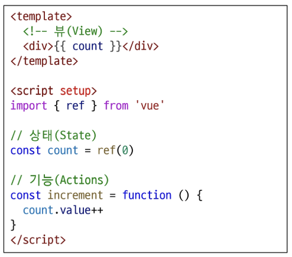

# 0608(Vue / State Management).md

# State Management

> **Vue의 컴포넌트 구조**
> 
- 상태(State) , 뷰(View), 기능(Actions)은 “단방향 데이터 흐름”으로 상호작용하고 있다
- 컴포넌트 구성요소
    - 상태 (State)
        - 앱 구동에 필요한 기본 데이터
    - 뷰 (View)
        - 상태를 선언적으로 매핑하여 시각화
    - 기능 (Actions)
        - 뷰에서 사용자 입력에 대해 반응적으로 상태를 변경할 수 있게 정의된 동작

> **상태 관리의 단순성 (단방향 데이터 흐름)이 무너지는 시점**
> 
- 여러 컴포넌트가 상태를 공유할 때
    1. 여러 뷰가 동일한 상태에 종속되는 경우
        - 공유 상태를 공통 조상 컴포넌트로 “끌어올린” 다음, props로 여러 컴포넌트에 전달하는 방법
        - 하지만 컴포넌트 계층 구조가 깊어질수록 이 방식은 비효율적이고 관리가 어려워 진다
    
    
    
    1. 서로 다른 뷰의 기능이 동일한 상태를 변경시켜야 하는 경우
        - 발신(emit) 된 이벤트를 통해 상태의 여러 복사본을 변경 및 동기화 하는 것
        - 마찬가지로 관리의 패턴이 깨지기 쉽고 유지 관리할 수 없는 코드가 된다

> **해결 방법**
> 
- 각 컴포넌트의 공유 상태를 추출하여, 전역에서 참조할 수 있는 저장소에서 관리한다
- 그리고 이 저장소의 역할을 하는 것이 “Pinia”

- “Pinia”는 Vue의 공식 상태 관리 라이브러리이다
- 컴포넌트 트리는 하나의 큰 View가 되고 모든 컴포넌트는 트리 계층 구조에 관계 없이 상태에 접근하거나 기능을 사용할 수 있다

## State management library (Pinia)

> **Pinia**
> 

> **Pinia 설치하기**
> 
- Vite 프로젝트 빌드 시 Pinia 라이브러리 추가
    - Vite : 빠른 개발 환경을 위한 빌드 도구와 개발 서버를 제공하는 프론트 엔드 개발 툴이다

> **Pinia 설치 후 Vue 프로젝트 구조 변화 살펴보기**
> 
- stores 폴더 신규 생성 확인

### Pinia 구성요소

> **Pinia 구성 요소**
> 
1. store
2. state
3. getters
4. actions
5. 반환 값
6. plugin

> **Pinia 구성 요소 : store**
> 
- 공통 데이터를 관리하는 중앙 저장소
- 모든 컴포넌트가 공유하는 상태이며, 기능이 작성된다

→ defineStore( ) 의 반환 값(store)을 담는 변수의 이름은 use…store 패턴을 사용하는 것을 권장 (예시 : useCounterStore)

→ defineStore( )의 첫 번째 인자는 애플리케이션 전체에 걸쳐 사용하는 store의 고유 ID

> **Pinia의 구성 요소 : state**
> 
- 중앙 저장소에 저장되는 반응형 상태 (데이터)
- 해당 값 (count)를 변경하면, 이 데이터를 사용하고 있는 모든 컴포넌트의 화면은 알아서 업데이트 된다
- ref( )와 같은 역할을 한다

> **Pinia의 구성 요소 : getters**
> 
- 계산된 값
- state를 기반으로 파생된 값을 정의하는 것
- computed( )와 똑같은 역할을 한다

> **Pinia의 구성 요소 : actions**
> 
- state를 변경하는 역할
- methods와 같은 역할을 한다

> **Pinia의 구성 요소 : 반환 값**
> 
- Pinia의 상태들을 사용하려면 반드시 반환해야 한다
- store에서는 공유하지 않는 private한 상태 속성을 가지지 않는다

> **Pinia 구성 요소 : plugin**
> 
- 애플리케이션의 상태 관리에 필요한 추가 기능을 제공하거나 확장하는 도구나 모듈이다
- 애플리케이션의 상태 관리를 더욱 간편하고 유연하게 만들어주며, 패키지 매니저로 설치 이후 별도 설정을 통해 추가 된다
- 예시 )
    - 모든 스토어의 상태를 자동으로 localstorage에 저장하고 복원해주는 플러그인
    - 해당 플러그인을 등록하면, 스토어의 state 값이 변경될 때마다 자동으로 브라우저의 localstorage에 저장된다
    - 그로 인해, 페이지 새로고침을 해도 값이 초기화되지 않고 유지된다

### Pinia 구성 요소 활용

> **Pinia 구성 요소 활용 : state**
> 
- 각 컴포넌트 깊이에 관계 없이 store 인스턴스로 state에 접근하여 직접 읽고 쓸 수 있다
- 만약 store에 state를 정의하지 않았다면 컴포넌트에서 새로 추가할 수 없다

> **Pinia 구성 요소 활용 : getters**
> 
- store의 모든 getters 또한 state 처럼 직접 접근 할 수 있다

> **Pinia 구성 요소 활용 : Actions**
> 
- store의 모든 actions 또한 직접 접근 및 호출할 수 있다

→ getters와 달리 state 조작, 비동기, API 호출이나 다른 로직을 진행할 수 있다

> **Vue devtools로 Pinia 구성 요소 확인하기**
> 

### Pinia 실습

> **Pinia를 활용한 Todo 프로젝트 구현**
> 
1. Todo CRUD 구현
2. Todo 개수 계산
    - 완료된 Todo 개수

#### 사전 준비

> **사전 준비**
> 

#### Todo 조회 (Read)

> **Todo 조회**
> 
- store에 임시 todos 목록 state를 정의

- store의 todos state를 참조
- 하위 컴포넌트인 TodoListItem을 반복하면서 개별 todo를 props로 전달

- props 정의 후 데이터 출력 확인

#### Todo 생성 (Create)

> **Todo 생성**
> 
- todos 목록에 todo를 생성 및 추가하는 addTodo 액션 정의

- TodoForm에서 실시간으로 입력되는 사용자 데이터를 양방향 바인딩하여 반응형 변수로 할당한다

- submit 이벤트가 발생 했을 때 사용자 입력 텍스트를 인자로 전달하여 store에 정의한 addTodo 액션 메서드를 호출

- form 요소를 선택하여 todo 입력 후 input 데이터를 초기화 할 수 있도록 처리

- 결과 확인

- store의 addTodo 액션을 직접 호출해도 되지만, 굳이 createTodo를 만들어서 호출하는 이유

→ addTodo 호출 전후로 추가 로직을 작성할 수 있기 때문이다

#### Todo 삭제 (Delete)

> **Todo 삭제**
> 
- todos 목록에서 특정 todo를 삭제하는 deleteTodo 액션 정의

- 각 todo에 버튼을 클릭하면 선택된 todo의 id를 인자로 전달해 deleteTodo 메서드 호출
- deleteTodo 메서드는 전달 받은 인자를 store의 deleteTodo에게 전달하며 호출

- store의 deleteTodo에 삭제 로직 구현
- 삭제 방법 1 (원본 편집)
    - findIndex를 활용해 하나만 찾아서 삭제
- 삭제 방법 2 (원본 덮어 씌우기)
    - filter로 삭제하지 않아도 되는 것들만 모아서 재생성

→ 위 방법 중 하나로 삭제를 구현한 후 결과 확인하기

- 삭제 방법 1
    - findIndex를 활용해 하나만 찾아서 삭제
    - 인덱스를 찾은 뒤 해당 위치에서 1개만 제거

- 삭제 방법 2
    - filter로 삭제하지 않아도 되는 것들만 모아서 재생성

#### Todo 수정 (Update)

> **Todo 수정**
> 
- (목표) 각 todo 상태의 isDone 속성을 변경하여 todo의 완료 유무를 처리하기
- (목표) 완료된 todo에는 취소선 스타일 적용하기
- todos 목록에서 특정 todo의 isDone 속성을 변경하는 updateTodo 액션 정의

- 체크 박스 클릭 ⇒ isDone ref 변경 → watch 감지 → store.updateTodo 호출

- store의 updateTodo에 수정 로직 구현
- 수정 방법 1
    - forEach를 활용해 하나만 찾아서 수정
- 수정 방법 2
    - map을 활용해 수정 해야 하는 항목을 찾아서 수정하고, 수정한 객체를 사용

- 수정 방법 1
    - forEach를 활용해 하나만 찾아서 수정
    - 순회 도중 일치 항목 찾으면 직접 속성 변경

- 수정 방법 2
    - map을 활용해 하나만 찾아서 수정
    - 모든 항목을 순회하며, ID가 일치하면 새 객체를 리턴

- todo 객체의 isDone 속성 값에 따라 스타일 바인딩 적용 후 결과 확인

### 수정과 삭제 구현 방식

> **수정과 삭제 구현에 대한 두 가지 관점**
> 
- In-place 방식 (하나만 수정 / 삭제)
    - 배열 전체 재생성 없이 필요한 항목만 바로 수정 또는 제거
- 전체 배열 재생성 방식
    - 배열을 순회하면서 특정 조건을 만족하지 않으면 누락하거나, 필요한 변경 사항만 반영해 새로운 배열을 만든 뒤 기존 배열에 재할당

→ 두 가지 접근 모두 성능과 가독성 면에서 큰 차이가 없는 경우가 많지만, 프로젝트나 팀 컨벤션에 따라 방식이 달라질 수 있다

→ 중요한 것은, 무엇을 의도하고 있는지 (단일 항목 수정 / 삭제 vs. 전체 재생성)를 명확히 알고 선택해야 한다

## Todo 카운팅

> **완료된 todo 개수 계산**
> 
- todos 배열의 길이 값을 반환하는 함수 doneTodosCount 작성 (getters)

- App 컴포넌트에서 doneTodosCount getter를 참조

## Local Storage

> **Local Storage**
> 

> **Local Storage 특징**
> 
- 페이지를 새로 고침하고 브라우저를 다시 실행해도 데이터가 유지된다
- 쿠키와 다르게 네트워크 요청 시 서버로 전송되지 않는다
    - 쿠키 : 서버가 사용자를 기억하려고 브라우저에 남기는 정보
- 여러 탭이나 창 간에 데이터를 공유할 수 있다

> **Local Storage 사용 목적**
> 
- 웹 애플리케이션에서 사용자 설정, 상태 정보, 캐시 데이터 등을 클라이언트 측에서 보관하여 웹사이트의 성능을 향상시키고 사용자 경험을 개선하기 위함이다

> **Pinia-plugin-persistedstate**
> 
- Pinia의 플러그인(plugin) 중 하나
- 웹 애플리케이션의 상태(state)를 브라우저의 local storage나 session storage에 영구적으로 저장하고 복원하는 기능을 제공한다

> **Pinia-plugin-persistedstate 설정**
> 
- npm 설치 및 등록 ( `$ npm i pinia-plugin-persistedstate` )

- defineStore( )의 3번째 인자로 관련 객체 추가

- 적용 결과 (개발자 도구 → Application → Local Storage)
    - 브라우저의 Local Storage에 저장되는 todos state 확인

## 참고

### Pinia 활용 시점

> **이제 모든 데이터를 store에서 관리해야 할까?**
> 
- Pinia를 사용한다고 해서 모든 데이터를 state에 넣어야 하는 것은 아니다
    
    → 컴포넌트 내부에서만 사용하는 데이터까지 Pinia로 관리하면, 코드가 불필요하게 복잡해진다
    
- pass props, emit event를 함께 사용하여 애플리케이션을 구성 해야 한다
    
    → 단순히 부모 , 자식 데이터 전달은 Pinia보다 props가 더 간단하고 직관적인 방법이다
    

→ 상황에 따라 적절하게 사용하는 것이 필요하다

> **그러면 Pinia, 언제 사용해야 할까?**
> 
- Pinia는 공유된 상태를 관리하는 데 유용하지만, 구조적인 개념을 이해하고 시작하는 비용이 크다
- 애플리케이션이 단순하다면 Pinia가 없는 것이 더 효율적일 수 있다
- 그러나 중대형 규모의 SPA를 구축하는 경우 Pinia는 자연스럽게 선택할 수 있는 단계가 오게 된다
- 결과적으로 적절한 상황에서 활용 했을 때 Pinia 효용을 극대화 할 수 있다

### 정리

