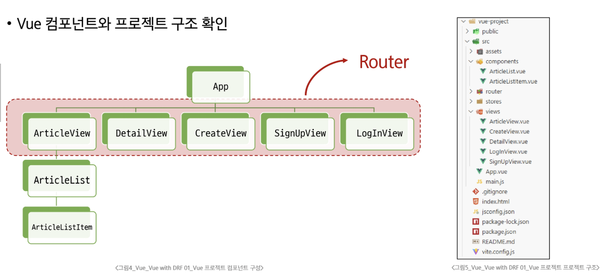

# 0609(Vue with DRF 01 / CORF Headers).md

# Vue with DRF 01 (CORS)

## Django 코드 구조

### Articles 경로

> **Articles/models.py**
> 

```python
from django.db import models
from django.conf import settings

class Article(models.Model):
    # user = models.ForeignKey(
    #     settings.AUTH_USER_MODEL, on_delete=models.CASCADE
    # )
    title = models.CharField(max_length=100)
    content = models.TextField()
    created_at = models.DateTimeField(auto_now_add=True)
    updated_at = models.DateTimeField(auto_now=True)

```

> **Articles/serializers.py**
> 

```python
from rest_framework import serializers
from .models import Article

# articles/serializers.py
class ArticleListSerializer(serializers.ModelSerializer):
    class Meta:
        model = Article
        fields = ('id', 'title', 'content')

class ArticleSerializer(serializers.ModelSerializer):
    class Meta:
        model = Article
        fields = '__all__'
        # read_only_fields = ('user',)

```

> **Articles/urls.py**
> 

```python
from django.urls import path
from . import views

# articles/url.py

urlpatterns = [
    path('articles/', views.article_list),
    path('articles/<int:article_pk>/', views.article_detail),
]

```

> **Articles/views.py**
> 

```python
from rest_framework.response import Response
from rest_framework.decorators import api_view
from rest_framework import status

# permission Decorators
# from rest_framework.decorators import permission_classes
# from rest_framework.permissions import IsAuthenticated

from django.shortcuts import get_object_or_404, get_list_or_404

from .serializers import ArticleListSerializer, ArticleSerializer
from .models import Article

@api_view(['GET', 'POST'])
# @permission_classes([IsAuthenticated])
def article_list(request):
    if request.method == 'GET':
        articles = get_list_or_404(Article)
        serializer = ArticleListSerializer(articles, many=True)
        return Response(serializer.data)

    elif request.method == 'POST':
        serializer = ArticleSerializer(data=request.data)
        if serializer.is_valid(raise_exception=True):
            serializer.save()
            # serializer.save(user=request.user)
            return Response(serializer.data, status=status.HTTP_201_CREATED)

@api_view(['GET'])
def article_detail(request, article_pk):
    article = get_object_or_404(Article, pk=article_pk)

    if request.method == 'GET':
        serializer = ArticleSerializer(article)
        print(serializer.data)
        return Response(serializer.data)

```

### Project 경로

> **settings.py**
> 

```python
"""
Django settings for my_api project.

Generated by 'django-admin startproject' using Django 4.2.4.

For more information on this file, see
https://docs.djangoproject.com/en/4.2/topics/settings/

For the full list of settings and their values, see
https://docs.djangoproject.com/en/4.2/ref/settings/
"""

from pathlib import Path

# Build paths inside the project like this: BASE_DIR / 'subdir'.
BASE_DIR = Path(__file__).resolve().parent.parent

# Quick-start development settings - unsuitable for production
# See https://docs.djangoproject.com/en/4.2/howto/deployment/checklist/

# SECURITY WARNING: keep the secret key used in production secret!
SECRET_KEY = (
    'django-insecure-@fn#327r=8uv%&a25(l(jc-e5ir*pu)v_%cyy*l%u@o)(^fnzs'
)

# SECURITY WARNING: don't run with debug turned on in production!
DEBUG = True

ALLOWED_HOSTS = []

# Application definition

# settings.py

INSTALLED_APPS = [
    'articles',
    'accounts',
    'rest_framework',
    # 'rest_framework.authtoken',
    # 'dj_rest_auth',
    'corsheaders',
    # 'django.contrib.sites',
    # 'allauth',
    # 'allauth.account',
    # 'allauth.socialaccount',
    # 'dj_rest_auth.registration',
    'django.contrib.admin',
    'django.contrib.auth',
    'django.contrib.contenttypes',
    'django.contrib.sessions',
    'django.contrib.messages',
    'django.contrib.staticfiles',
]

# SITE_ID = 1

# REST_FRAMEWORK = {
#     # Authentication
#     'DEFAULT_AUTHENTICATION_CLASSES': [
#         'rest_framework.authentication.TokenAuthentication',
#     ],
#     # permission
#     'DEFAULT_PERMISSION_CLASSES': [
#         'rest_framework.permissions.AllowAny',
#     ],
# }

MIDDLEWARE = [
    'django.middleware.security.SecurityMiddleware',
    'django.contrib.sessions.middleware.SessionMiddleware',
    'corsheaders.middleware.CorsMiddleware',
    'django.middleware.common.CommonMiddleware',
    'django.middleware.csrf.CsrfViewMiddleware',
    'django.contrib.auth.middleware.AuthenticationMiddleware',
    'django.contrib.messages.middleware.MessageMiddleware',
    'django.middleware.clickjacking.XFrameOptionsMiddleware',
    # 'allauth.account.middleware.AccountMiddleware',
]

CORS_ALLOWED_ORIGINS = [
    'http://127.0.0.1:5173',
    'http://localhost:5173',
]

ROOT_URLCONF = 'my_api.urls'

TEMPLATES = [
    {
        'BACKEND': 'django.template.backends.django.DjangoTemplates',
        'DIRS': [],
        'APP_DIRS': True,
        'OPTIONS': {
            'context_processors': [
                'django.template.context_processors.debug',
                'django.template.context_processors.request',
                'django.contrib.auth.context_processors.auth',
                'django.contrib.messages.context_processors.messages',
            ],
        },
    },
]

WSGI_APPLICATION = 'my_api.wsgi.application'

# Database
# https://docs.djangoproject.com/en/4.2/ref/settings/#databases

DATABASES = {
    'default': {
        'ENGINE': 'django.db.backends.sqlite3',
        'NAME': BASE_DIR / 'db.sqlite3',
    }
}

# Password validation
# https://docs.djangoproject.com/en/4.2/ref/settings/#auth-password-validators

AUTH_PASSWORD_VALIDATORS = [
    {
        'NAME': 'django.contrib.auth.password_validation.UserAttributeSimilarityValidator',
    },
    {
        'NAME': 'django.contrib.auth.password_validation.MinimumLengthValidator',
    },
    {
        'NAME': 'django.contrib.auth.password_validation.CommonPasswordValidator',
    },
    {
        'NAME': 'django.contrib.auth.password_validation.NumericPasswordValidator',
    },
]

# Internationalization
# https://docs.djangoproject.com/en/4.2/topics/i18n/

LANGUAGE_CODE = 'en-us'

TIME_ZONE = 'UTC'

USE_I18N = True

USE_TZ = True

# Static files (CSS, JavaScript, Images)
# https://docs.djangoproject.com/en/4.2/howto/static-files/

STATIC_URL = 'static/'

# Default primary key field type
# https://docs.djangoproject.com/en/4.2/ref/settings/#default-auto-field

DEFAULT_AUTO_FIELD = 'django.db.models.BigAutoField'

AUTH_USER_MODEL = 'accounts.User'

```

> **urls.py**
> 

```python
from django.contrib import admin
from django.urls import path, include

# my_api/urls.py

urlpatterns = [
    path('admin/', admin.site.urls),
    path('api/v1/', include('articles.urls')),
    # path('accounts/', include('dj_rest_auth.urls')),
    # path('accounts/signup/', include('dj_rest_auth.registration.urls')),
]

```

## Vue.js 코드 구조



### router 경로

> **index.js**
> 

```jsx
// router/index.js

import { createRouter, createWebHistory } from 'vue-router'
import ArticleView from '@/views/ArticleView.vue'
import DetailView from '@/views/DetailView.vue'
import CreateView from '@/views/CreateView.vue'
// import SignUpView from '@/views/SignUpView.vue'
// import LogInView from '@/views/LogInView.vue'

const router = createRouter({
  history: createWebHistory(import.meta.env.BASE_URL),
  routes: [
    {
      path: '/',
      name: 'ArticleView',
      component: ArticleView
    },
    {
      path: '/articles/:id',
      name: 'DetailView',
      component: DetailView
    },
    {
      path: '/create',
      name: 'CreateView',
      component: CreateView
    }
    // {
    //   path: '/signup',
    //   name: 'SignUpView',
    //   component: SignUpView
    // },
    // {
    //   path: '/login',
    //   name: 'LogInView',
    //   component: LogInView
    // },
  ]
})

export default router

```

### stores 경로

> **articles.js**
> 

```jsx
// store/articles.js

import { ref, computed } from 'vue'
import { defineStore } from 'pinia'
import axios from 'axios'

export const useArticleStore = defineStore('article', () => {
  const articles = ref([])
  const API_URL = 'http://127.0.0.1:8000'

  const getArticles = function () {
    axios({
      method: 'get',
      url: `${API_URL}/api/v1/articles/`
    })
      .then(res => {
        articles.value = res.data
      })
      .catch(err => console.log(err))
  }
  return { articles, API_URL, getArticles }
}, { persist: true })

```

### components 경로

> **ArticleList.vue**
> 

```jsx
<!-- components/ArticleList.vue -->

<template>
  <div>
    <h3>Article List</h3>
    <ArticleListItem
      v-for="article in store.articles"
      :key="article.id"
      :article="article"
    />
  </div>
</template>

<script setup>
import { useArticleStore } from '@/stores/articles'
import ArticleListItem from '@/components/ArticleListItem.vue'

const store = useArticleStore()
</script>

```

> **ArticleListItem.vue**
> 

```jsx
<!-- components/ArticleListItem.vue -->

<template>
  <div>
    <h5>{{ article.id }}</h5>
    <p>{{ article.title }}</p>
    <p>{{ article.content }}</p>
    <RouterLink :to="{ name: 'DetailView', params: { id: article.id } }">
      [DETAIL]
    </RouterLink>
    <hr>
  </div>
</template>

<script setup>
import { RouterLink } from 'vue-router'

defineProps({
  article: Object
})
</script>

```

### views 경로

> **ArticleView.vue**
> 

```jsx
<!-- views/ArticleView.vue -->

<template>
  <div>
    <h1>Article Page</h1>
    <RouterLink :to="{ name:'CreateView' }">
      [CREATE]
    </RouterLink>
    <hr>
    <ArticleList />
  </div>
</template>

<script setup>
import { onMounted } from 'vue'
import { useArticleStore } from '@/stores/articles'
import { RouterLink } from 'vue-router'
import ArticleList from '@/components/ArticleList.vue'

const store = useArticleStore()

onMounted(() => {
  store.getArticles()
})
</script>

<style>

</style>

```

> **CreateView.vue**
> 

```jsx
<!-- views/CreateView.vue -->

<template>
  <div>
    <h1>게시글 작성</h1>
    <form @submit.prevent="createArticle">
      <label for="title">제목 : </label>
      <input type="text" id="title" v-model.trim="title"><br>
      <label for="content">내용 : </label>
      <textarea id="content" v-model.trim="content"></textarea><br>
      <input type="submit">
    </form>
  </div>
</template>

<script setup>
import axios from 'axios'
import { ref } from 'vue'
import { useArticleStore } from '@/stores/articles'
import { useRouter } from 'vue-router'

const store = useArticleStore()
const router = useRouter()

const title = ref(null)
const content = ref(null)

const createArticle = function () {
  axios({
    method: 'post',
    url: `${store.API_URL}/api/v1/articles/`,
    data: {
      title: title.value,
      content: content.value
    },
  })
    .then(() => {
      router.push({name: 'ArticleView'})
    })
    .catch(err => console.log(err))
}
</script>

<style>

</style>

```

> **DetailView.vue**
> 

```jsx
<!-- views/DetailView.vue -->

<template>
  <div>
    <h1>Detail</h1>
    <div v-if="article">
      <p>글 번호 : {{ article.id }}</p>
      <p>제목 : {{ article.title }}</p>
      <p>내용 : {{ article.content }}</p>
      <p>작성시간 : {{ article.created_at }}</p>
      <p>수정시간 : {{ article.updated_at }}</p>
    </div>
  </div>
</template>

<script setup>
import axios from 'axios'
import { onMounted, ref } from 'vue'
import { useRoute } from 'vue-router'
import { useArticleStore } from '@/stores/articles'

const store = useArticleStore()
const route = useRoute()
const article = ref(null)

onMounted(() => {
  axios({
    method: 'get',
    url: `${store.API_URL}/api/v1/articles/${route.params.id}/`,
  })
    .then((res) => {
      article.value = res.data
    })
    .catch(err => console.log(err))
})
</script>

<style>

</style>

```

### App.vue

> **App.vue**
> 

```jsx
<!-- App.vue -->

<template>
  <header>
    <nav>
      <RouterLink :to="{ name:'ArticleView' }">Articles</RouterLink>
    </nav>
  </header>
  <RouterView />
</template>

<script setup>
import { RouterView, RouterLink } from 'vue-router'
</script>

<style scoped>
</style>

```

### main.js

> **main.js**
> 

```jsx
import piniaPluginPersistedstate from 'pinia-plugin-persistedstate'

import { createApp } from 'vue'
import { createPinia } from 'pinia'

import App from './App.vue'
import router from './router'

const app = createApp(App)
const pinia = createPinia()

pinia.use(piniaPluginPersistedstate)
// app.use(createPinia())
app.use(pinia)
app.use(router)

app.mount('#app')

```

## 게시글 목록 출력

> **게시글 목록 출력**
> 


## DRF와의 요청과 응답

> **DRF로 부터 응답 데이터 받기**
> 
- 이전에 임시 데이터를 작성했던 부분을 DRF 서버에 요청하고, 데이터를 응답 받아 store에 저장 후 출력하기


> **DRF와의 요청과 응답**
> 


## CORS Policy

> **웹 브라우저의 동일 출처 정책과 보안**
> 
- 기본적으로 웹 브라우저는 같은 출처에서만 요청하는 것을 허용한다
- 다른 출처로의 요청은 보안상의 이유로 차단한다
- 이는 SOP (동일 출처 정책) 에 의해 다른 출처의 리소스와 상호작용 하는 것이 기본적으로 제한 된다

> **SOP (Same-Origin Policy)**
> 


- 어떤 출처 (Origin) 에서 불러온 문서나 스크립트가 다른 출처에서 가져온 리소스와 상호 작용하는 것을 제한하는 보안 방식이다

> **Origin (출처)**
> 
- URL의 Protocol, Host, Port를 모두 포함하여 “출처”라고 부른다
- Same Origin 예시
    - 아래 세 영역이 일치하는 경우에만 동일 출처(Same-Origin)로 인정


> **CORS Policy의 등장**
> 
- 기본적으로 웹 브라우저는 같은 출처에서만 요청하는 것을 허용한다
- 다른 출처로의 요청은 보안상의 이유로 차단한다
- 이는 SOP에 의해 다른 출처의 리소스와 상호작용 하는 것이 기본적으로 제한된다
- 하지만 현대 웹 애플리케이션은 다양한 출처로부터 리소스를 요청하는 경우가 많기 때문에 CORS 정책이 필요하게 되었다

→ CORS는 웹 서버가 리소스에 대한 서로 다른 출처 간 접근을 허용하도록 선택할 수 있는 기능을 제공한다

> **CORS (Cross-Origin Resource Sharing)**
> 


- 특정 출처에서 실행 중인 웹 애플리케이션이 다른 출처의 자원에 접근할 수 있는 권한을 부여하도록 브라우저에 알려주는 체제이다

→ 만약 다른 출처의 리소스를 가져오기 위해서는 이를 제공하는 서버가 브라우저에게 다른 출처지만 접근해도 된다는 사실을 알려야 한다

- 서버에서 설정되며, 브라우저가 해당 정책을 확인하여 요청이 허용되는지 여부를 결정한다

→ 다른 출처의 리소스를 불러오려면 그 다른 출처에서 올바른 CORS header를 포함한 응답을 반환해야 한다

> **CORS 적용 방법**
> 
- Server(도메인B)
    - HTTP Header에 “Access-Control-Allow-Origin: 도메인A” 가 포함되면, 이제 도메인 A에서의 요청은 서버의 자원에 접근할 수 있다
- Browser(도메인A)
    - Server(도메인 B)에 등록됐기 때문에 안전하게 Server (도메인 B) 의 데이터를 사용할 수 있다


> **CORS policy 정리**
> 
- 웹 애플리케이션이 다른 도메인에 있는 리소스에 안전하게 접근할 수 있도록 허용 또는 차단하는 보안 메커니즘
- 서버가 약속된 CORS Header를 포함하여 응답한다면, 브라우저는 해당 요청을 허용한다

→ 서버에서 CORS Header를 만들어야 한다

### CORS Headers 설정

> **Django에서 CORS Header 설정하기**
> 


## 게시글 생성 / 조회 구현

### 전체 게시글 조회

> **전체 게시글 목록 저장 및 출력**
> 


### 단일 게시글 조회

> **단일 게시글 데이터 출력**
> 


### 게시글 작성

> **게시글 작성**
> 


### 정리


