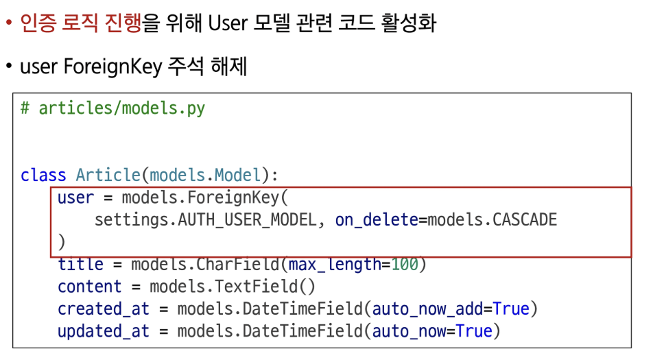

# 0610(Vue with DRF 02 / Authentication and Permission).md

# Vue with DRF 02 (AUTH)

## 인증 with DRF

> **사전 준비**
> 

## 인증

> **인증의 필요성**
> 
- 클라이언트와 서버 간의 상태 정보를 유지하기 위해서 쿠키와 세션을 사용
- 하지만, 클라이언트와 서버는 사용자를 식별하지 못하고 있는 상태
- 그래서 사용자를 식별하기 위해서 필요한 과정이 바로 ‘인증(Authentication)’
- 다양한 인증이 존재
    - 아이디와 비밀번호
    - 소셜 로그인 (OAuth)
    - 생체인증

→ Django 에서는 사용자 인증과 관련된 가장 중요하고 기본적인 뼈대를 제공

(Django Authentication System)

> **DRF 에서의 인증**
> 
- 인증은 항상 view 함수 시작 시 다른 코드의 진행이 허용되기 전에 실행된다
    - 수신 요청을 해당 요청의 사용자 또는 해당 요청이 서명된 토큰(token)과 같은 자격 증명 자료와 연결
- 이후 인증이 완료된 해당 자격 증명을 사용하여 권한 및 제한 정책을 확인하고, 요청을 허용해야 하는 지를 결정한다

> **승인되지 않은 응답 및 금지된 응답**
> 
- 인증되지 않은 요청이 권한을 거부하는 경우 해당되는 두 가지 오류 코드를 응답한다
1. HTTP 401 Unauthorized
    - “요청에 유효한 인증 자격 증명(Authentication Credentials)이 없어 사용자를 식별할 수 없음” 을 의미한다
    (누구인지를 증명할 자료가 없음)
2. HTTP 403 Forbidden (Permission Denied)
    - 서버에 요청이 전달되었지만, 권한 때문에 거절되었다는 것을 의미한다
    - 401과 다른 점은 서버는 클라이언트가 누구인지 알고 있다

### 인증 정책 설정

> **인증 정책 설정 방법 두 가지**
> 
1. 전역 설정
2. View 함수 별 설정

> **전역 설정**
> 
- 프로젝트 전체에 적용되는 기본 인증 방식을 정의
- DEFAULT_AUTHENTICATION_CLASSES를 사용
- 기본 값 : SessionAuthentication과 BasicAuthentication
- 사용 예시 (DRF 공식 문서 참고)

> **View 함수 별 설정**
> 
- authentication_classes 데코레이터를 사용
- 개별 view에 지정하여 재정의
- 사용 예시 (DRF 공식 문서 참고)

> **DRF가 제공하는 인증 체계**
> 
1. BasicAuthentication
    - 요청마다 사용자 이름과 비밀번호를 Base64로 인코딩하여 Authorization 헤더에 담아 보내는 방식
2. TokenAuthentication
    - 로그인 시 발급 받은 고유한 토큰(Token)을 Authorization 헤더에 담아 요청함으로써 사용자를 인증하는 방식
3. SessionAuthentication
    - 장고의 기본 세션 시스템을 활용하여, 브라우저가 보내는 sessioned 쿠키를 통해 사용자를 인증하는 방식
4. RemoteUserAuthentication
    - 웹 서버 등 외부 시스템이 이미 처리한 인증 결과를 신뢰하고, 전달 받은 사용자 이름으로 사용자를 인증하는 방식

> **TokenAuthentication**
> 
- token 기반 HTTP 인증  체계
- 로그인 시 발급 받은 고유한 토큰을 Authorization 헤더에 담아 요청함으로써 사용자를 인증하는 방식
- 기본 데스크톱 및 모바일 클라이언트와 같은 클라이언트-서버 설정에 적합하다

→ 서버가 인증된 사용자에게 토큰을 발급하고 사용자는 매 요청마다 발급 받은 토큰을 요청과 함께 보내 인증 과정을 거친다

### Token 인증 설정

> **TokenAuthentication 적용 과정**
> 
1. 인증 클래스 설정
2. INSTALLED_APPS 추가
3. Migrate 진행

> **인증 클래스 설정**
> 
- TokenAuthentication 활성화 코드 주석 해제

→ 전역 인증 정책을 Token 방식으로 설정

> **INSTALLED_APPS 추가**
> 
- rest_framework.authtoken 주석 해제

→ 이후 Migrate 진행

> **토큰 인증 방식 과정 정리**
> 

## Dj-Rest_Auth 라이브러리

> **Dj-Rest-Auth**
> 
- 회원가입, 로그인/로그아웃, 비밀번호 재설정, 소셜 로그인 등 다양한 인증 관련 기능을 API 엔드포인트로 제공하는 라이브러리
- dj-rest-auth는 django.contrib.auth를 대체하는 것이 아니라, 그 위에 만들어져 기능을 확장한다

→ 인증 기능을 RESTfull API로 제공한다

> **Dj-Rest-Auth 설치 및 적용**
> 

> **Dj-Rest-Auth의 Registration(등록) 기능 추가 설정**
> 

### Token 발급 및 활용

> **Token 발급**
> 

- 회원 가입 진행 (DRF 페이지 하단 회원 가입 form 사용)
    - http://127.0.0.1:8000/accounts/signup/

- 로그인 진행 (DRF 페이지 하단 로그인 form 사용)
    - http://127.0.0.1:8000/accounts/login/

- 로그인 성공 후 DRF로 부터 발급 받은 Token 확인

→ 이제 이 Token을 Vue에서 별도로 저장하여 매 요청마다 함께 보내야 한다

> **Token 활용**
> 

> **클라이언트가 Token으로 인증 받는 방법**
> 
1. “Authorization” HTTP Header에 포함
2. 키 앞에는 문자열 “Token”이 와야 하며 “공백”으로 두 문자열을 구분해야 한다

> **Token 데이터 확인**
> 
- Django DB 확인
- 발급 받은 Token을 인증이 필요한 요청마다 함께 보내야 한다

## 권한 with DRF

### 권한 정책 설정

> **권한 정책 설정**
> 
1. 전역 설정
2. View 함수 별 설정

> **전역 설정**
> 
- 프로젝트 전체에 적용되는 기본 권한 방식을 정의
- DEFAULT_PERMISSION_CLASSES를 사용
- 기본 값 : rest_framework.permissions.AllowAny
- 사용 예시 (DRF 공식 문서 참고)

> **View 함수 별 설정**
> 
- permisson_classes 데코레이터를 사용
- 개별 view에 지정하여 재정의
- 사용 예시 (DRF 공식 문서 참고)

> **DRF가 제공하는 권한 정책**
> 
1. IsAuthenticated
    - 인증된(로그인 한) 사용자만 접근을 허용
2. IsAdminUser
    - 스태프 권한(is_staff=True)을 가진 관리자 사용자만 접근을 허용
3. IsAuthenticatedOrReadOnly
    - 인증된 사용자는 모든 요청 (읽기/쓰기)을 허용하고, 비인증 사용자는 읽기 전용 요청만 하용
4. AllowAny
    - 아무런 제한 없이 모든 사용자의 접근을 허용

> **IsAuthenticated**
> 
- 개념
    - 인증된 사용자만 접근을 허용하는 권한 클래스
    - 인증되지 않은 사용자의 모든 요청을 거부
- 특징
    - request.user가 존재하고 인증된 상태인지 확인
    - 보호해야 할 중요한 데이터나 리소스에 적합 (예 : 회원 전용 페이지, 결제, 프로필 수정 등)

> **IsAdminUser**
> 
- 개념
    - 관리자(is_staff=True) 권한을 가진 사용자만 접근을 허용하는 권한 클래스
    - 일반 사용자와 비인증 사용자의 모든 요청을 거부
- 특징
    - request.user.is_staff 속성 값이 True인지 확인하여 관한을 검사
    - 회원 목록 조회, 데이터 통계 등 사이트 관리자에게만 노출되어야 하는 민감한 API에 적합

> **IsAuthenticatedOrReadOnly**
> 
- 개념
    - 비인증 사용자는 읽기만 허용하고, 인증된 사용자는 모든 요청(읽기/쓰기)을 허용하는 권한 클래스
- 특징
    - 요청 메서드가 GET, HEAD, OPTIONS와 같은 안전한 메서드일 경우 무조건 허용하고, 그 외 메서드(POST, PUT 등)는 사용자의 인증 여부를 확인
    - 게시글 목록처럼 누구나 볼 수 있지만, 글 작성이나 수정은 회원만 가능한 API에 주로 적용

> **AllowAny**
> 
- 개념
    - 모든 요청을 무조건 허용하는 권한 클래스
    - 인증된 사용자든, 인증되지 않은 사용자든 상관 없이 모두에게 접근을 허용
- 특징
    - 권한 검사 (Authorization) 로직을 전혀 수행하지 않는다
    - API 엔드포인트를 완전히 공개하고 싶을 때 사용한다
    - 보안이 필요한 리소스에는 부적합하므로, 회원입, 로그인 또는 공개 게시글 조회 등 공개 API에 주로 적용

### IsAuthenticated 설정

> **IsAuthenticated 권한 설정**
> 
- DEFAULT_PERMISSION_CLASSES 주석 해제

→ 기본적으로 모든 View 함수에 대한 접근을 허용 (AllowAny)

> **권한 활용하기**
> 

### 정리

