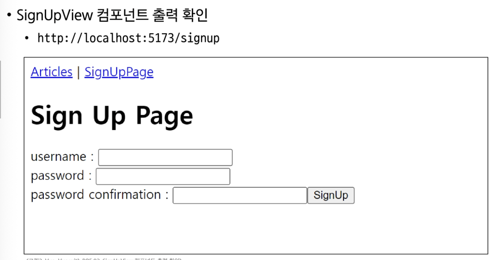

# 0611(Vue with DRF 03 / Customize User).md

# **Vue with DRF 03 (Customize User)**

## **인증 with Vue**

> **사전 준비**
> 
- DB 초기화
    - db.sqlite3 삭제
- Migration 과정 재진행
- 관리자 계정 생성 후 , 게시글 1개 이상 작성
    - 기존 fixtures 데이터는 user 정보가 없으므로 사용 불가능

### 회원가입

> **회원가입 로직 구현**
> 

```jsx
// router/index.js

import SignUpView from '@/views/SignUpView.vue'

const router = createRouter({
  history: createWebHistory(import.meta.env.BASE_URL),
  routes: [
    ...,
    {
      path: '/signup',
      name: 'SignUpView',
      component: SignUpView
    }
  ]
})
export default router
```

```html
<!-- App.vue -->

<template>
  <header>
    <nav>
      <RouterLink :to="{ name:'ArticleView' }">Articles</RouterLink>
      <RouterLink :to="{ name: 'SignUpView'}">SignUpPage</RouterLink>
    </nav>
  </header>
  <RouterView />
</template>
```

```html
<!-- views/SignUpView.vue -->

<template>
  <div>
    <h1>Sign Up Page</h1>
    <form @submit.prevent="signUp">
      <label for="useranme">useranme: </label>
      <input type="text" id="username" v-model.trim="username" /> <br>

      <label for="password1">password: </label>
      <input type="password" id="password1" v-model.trim="password1" /> <br>

      <label for="password2">password confirmation: </label>
      <input type="password" id="password2" v-model.trim="password2" /> <br>

      <input type="submit" value="signup">
    </form>
  </div>
</template>
```

```
<!-- views/SignUpView.vue -->

<template>
  <div>
    <h1>Sign Up Page</h1>
    <form>
      <label for="useranme">useranme: </label>
      <input type="text" id="username" v-model.trim="username" /> <br>

      <label for="password1">password: </label>
      <input type="password" id="password1" v-model.trim="password1" /> <br>

      <label for="password2">password confirmation: </label>
      <input type="password" id="password2" v-model.trim="password2" /> <br>

      <input type="submit" value="signup">
    </form>
  </div>
</template>

// views/SignUpView.vue
import { ref } from 'vue'

const username = ref(null)
const password1 = ref(null)
const password2 = ref(null)
```



```jsx
// stores/accounts.js

export const useAccountStore = defineStore('account', () => {
  const signUp = function () {
    ...
  }
  return { signUp }
}, { persist: true })
```

```
// views/SignUpView.vue
import { useAccountStore } from '@/stores/accounts'

const accountStore = useAccountStore()

const signUp = function () {
  const payload = {
    username: username.value,
    password1: password1.value,
    password2: password2.value,
  }
  accountStore.signUp(payload)
}

<!-- views/SignUpView.vue -->

<template>
  <div>
    <h1>Sign Up Page</h1>
    <form @submit.prevent="signUp">
      <label for="useranme">useranme: </label>
      ...

    </form>
  </div>
</template>
```

- 실제 회원가입 요청을 보내는 storeq의 signUp 함수 작성

```jsx
// stores/accounts.js

const signUp = function (payload) {
  const username = payload.username
  const password1 = payload.password1
  const password2 = payload.password2
  // const { username, password1, password2 } = payload

  axios({
    method: 'post',
    url: `${API_URL}/accounts/signup/`,
    data: {
      username, password1, password2
    }
  })
    .then(res => {
      console.log('회원가입이 완료되었습니다.')
    })
    .catch(err => console.log(err))
}
```


### 로그인

```jsx
// router/index.js

import LogInView from '@/views/LogInView.vue'

const router = createRouter({
  history: createWebHistory(import.meta.env.BASE_URL),
  routes: [
    ...,
    {
      path: '/login',
      name: 'LogInView',
      component: LogInView
    }
  ]
})
```

```html
<!-- App.vue -->

<template>
  <header>
    <nav>
      <RouterLink :to="{ name:'ArticleView' }">Articles</RouterLink>
      <RouterLink :to="{ name:'SignUpView' }">SignUpPage</RouterLink>
      <RouterLink :to="{ name:'LogInView' }">LogInPage</RouterLink>
    </nav>
  </header>
  <RouterView />
</template>
```

```html
<!-- views/LoginView.vue -->

<template>
  <div>
    <h1>LogIn Page</h1>
    <form>
      <label for="username">username: </label> <br>
      <input type="text" id="username" v-model.trim="username" /> <br>

      <label for="password">password: </label> <br>
      <input type="password" id="password" v-model.trim="password" /> <br>

      <input type="submit" value="LogIn"/>
    </form>
  </div>
</template>
```

```
<!-- views/LoginView.vue -->

<template>
  <div>
    <h1>LogIn Page</h1>
    <form>
      <label for="username">username: </label> <br>
      <input type="text" id="username" v-model.trim="username"/> <br>

      <label for="password">password: </label> <br>
      <input type="password" id="password" v-model.trim="password" /> <br>

      <input type="submit" value="LogIn"/>
    </form>
  </div>
</template>

// views/LoginView.vue
import { ref } from 'vue';

const username = ref(null)
const password = ref(null)
```


```jsx
// stores/accounts.js

export const useAccountStore = defineStore('account', () => {
  const logIn = function () {
    ...
  }

  return { signUp, logIn }
}, { persist: true })
```

```
// views/LoginView.vue

import { useAccountStore } from '@/stores/accounts.js'

const accountStore = useAccountStore()

const logIn = function () {
  const payload = {
    username: username.value,
    password: password.value
  }
  accountStore.logIn(payload)
}

<!-- views/LoginView.vue -->

<template>
  <div>
    <h1>LogIn Page</h1>
    <form @submit.prevent="logIn">
      ...
    </form>
  </div>
</template>
```

```jsx
// stores/accounts.js

const logIn = function (payload) {
  const username = payload.username
  const password = payload.password

  axios({
    method: 'post',
    url: `${API_URL}/accounts/login/`,
    data: {
      username, password
    }
  })
    .then(res => {
      console.log('로그인이 완료되었습니다.')
      console.log(res.data)
    })
    .catch(err => console.log(err))
}
```


### 요청과 토큰

> **토큰 저장 로직 구현**
> 

```jsx
// stores/accounts.js

export const useAccountStore = defineStore('account', () => {
  const token = ref(null)

  const logIn = function (payload) {
    ...
    .then(res => {
      token.value = res.data.key
    })
    .catch(err => console.log(err))
  }

  return { signUp, logIn, token }
}, { persist: true })
```


```jsx
// stores/accounts.js

import { useRouter } from 'vue-router'

export const useAccountStore = defineStore('account', () => {
  const router = useRouter()

  const logIn = function (payload) {
    ...
    .then(res => {
      token.value = res.data.key
      router.push({ name: 'ArticleView' })
    })
    .catch(err => console.log(err))
  }
})
```

> **토큰이 필요한 요청**
> 
1. 게시글 전체 목록 조회 시
2. 게시글 작성 시

> **게시글 전체 목록 조회 with token**
> 
- 게시글 전체 목록 조회 요청 함수 (getArticles)에 token 추가 후 게시글 전체 목록 조회하기

```jsx
// stores/articles.js

import { useAccountStore } from './accounts'

export const useArticleStore = defineStore('article', () => {
  const accountStore = useAccountStore()

  const getArticles = function () {
    axios({
      method: 'get',
      url: `${API_URL}/api/v1/articles/`,
      headers: {
        'Authorization': `Token ${accountStore.token}`
      }
    })
    ...
```

> **게시글 생성 with token**
> 
- 게시글 생성 요청 함수 (createArticle)에 token 추가 후 게시글 생성하기

```jsx
// views/CreateView.vue

import { useAccountStore } from '@/stores/accounts'
const accountStore = useAccountStore()

const createArticle = function () {
  axios({
    method: 'post',
    url: `${store.API_URL}/api/v1/articles/`,
    data: {
      ...
    },
    headers: {
      'Authorization': `Token ${accountStore.token}`
    }
  })}
```

### 인증 여부 확인

> **사용자의 인증 (로그인) 여부에 따른 추가 기능 구현**
> 
1. 인증되지 않은 사용자
    
    → 메인 페이지 접근 제한
    
2. 인증된 사용자
    
    → 회원가입 및 로그인 페이지에 접근 제한
    

> **인증 상태 여부를 나타낼 속성 값 지정**
> 
- token 소유 여부에 따라 로그인 상태를 나타낼 isLogin 변수 작성
- 그리고 computed를 활용해 token 값이 변경될 때만 이 상태를 다시 계산하도록 한다

```jsx
// stores/accounts.js

export const useAccountStore = defineStore('account', () => {
  ...

  const isLogin = computed(() => {
    return token.value ? true : false
  })

  ...

  return { signUp, logIn, token, isLogin }
}, { persist: true })
```

> **인증되지 않은 사용자는 메인 페이지 접근 제한**
> 


- 브라우지 local storage에서 token을 삭제 후 메인 페이지 접속 시도


> **인증된 사용자는 회원가입과 로그인 페이지에 접근 제한**
> 


## User Customize

> **사전 준비**
> 
- DB 초기화
    - db.splite3 삭제

> **User Model에 필드 추가**
> 
- PositiveIntegerField : 음수가 될 수 없는 숫자가 저장되는 필드


> **Vue 회원 가입 기능 수정**
> 
- age 입력을 위한 input과 변수 및 payload data 수정
    - payload data : 헤더, 메타데이터를 제외한 전송의 목적이 되는 데이터


- signUp 함수에 age 정보 추가


> **회원 가입 진행 결과**
> 


> **RegisterSerializer**
> 
- dj-rest-auth의 RegisterSerializer의 field 정보 확인
- username, email, password1, password2 필드만 정의 되어 있다


- [https://github.com/iMerica/dj-rest-auth/blob/master/dj_rest_auth/registration/serializers.py#L224](https://github.com/iMerica/dj-rest-auth/blob/master/dj_rest_auth/registration/serializers.py#L224)

### Customize RegisterSerializer

> **회원 가입 기능 수정**
> 


## 참고

### 로그아웃


### 기타 기능 구현

> **회원 가입 성공 후 자동으로 로그인까지 진행**
> 


### Django Signals

> **Django Signals**
> 
- “이벤트 알림 시스템”
- 애플리케이션 내에서 특정 이벤트가 발생할 때, 다른 부분에 신호를 보내어 이벤트가 발생했음을 알릴 수 있다
- 주로 모델의 데이터 변경 또는 저장, 삭제와 같은 작업에 반응하여 추가적인 로직을 실행하고자 할 때 사용한다
    - 예를 들어, 사용자가 새로운 게시글을 작성할 때마다 특정 작업 (예 : 이메일 알림 보내기)을 수행하려는 경우


### 환경 변수

> **환경 변수 (environment variable)**
> 
- 애플리케이션의 설정이나 동작을 제어하기 위해 사용되는 변수
- 개발, 테스트 및 프로덕션 환경에서 다르게 설정되어야 하는 설정 값이나 민감한 정보 (ex. API key)를 포함
- 환경 변수를 사용하여 애플리케이션의 설정을 관리하면, 다양한 환경에서 일관된 동작을 유지하면서 필요에 따라 변수를 쉽게 변경할 수 있다
- 보안적인 이슈를 피하고, 애플리케이션을 다양한 환경에 대응하기 쉽게 만들어 준다

> **Vite에서 환경 변수를 사용하는 방법**
> 
- .env.local 파일 생성 및 API 변수 작성
- 주의사항
    - 변수명은 반드시 VITE_ 접두어를 작성해야 한다
    - 변수명과 값 사이에 공백이 없어야 한다


### Vue 참고 자료

> **Vue 프로젝트 진행 시 유용한 자료**
> 
- Awesome Vue.js
    - Vue와 관련하여 엄선된 유용한 자료를 아카이빙 및 관리하는 프로젝트
    - [https://github.com/vuejs/awesome-vue](https://github.com/vuejs/awesome-vue)
    - [https://awesome-vue.js.org/](https://awesome-vue.js.org/)
- Vuetify
    - Vue를 위한 UI 라이브러리 (ex. ‘Bootstrap’)
    - [https://vuetifyjs.com/en/](https://vuetifyjs.com/en/)

### 설치한 라이브러리 정리


### 정리


